+++
title = '使用pve安裝TP-Link Omada SDN Controller'
date = 2024-08-15T15:42:24+08:00
draft = false
image = 'omada.png'
categories = [
    "linux"
]
tags = [
    "linux",
]
+++

## 前言 ##
Tp-link omada SDN目前只有兩種型號(OC200、OC300)，也可以透過官方提供的docker文件來架設
本篇使用pve建立容器並執行。
> ### 優點
>  - 省錢
>  - 省電
>  - 功能齊全
> ### 缺點
>  - 依照你的機器決定穩不穩定
>  - 較耗電

---

## 開始安裝
選擇你的容器

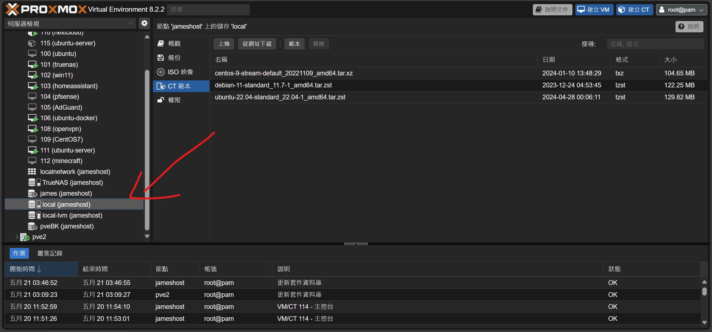

## 選擇CT範本

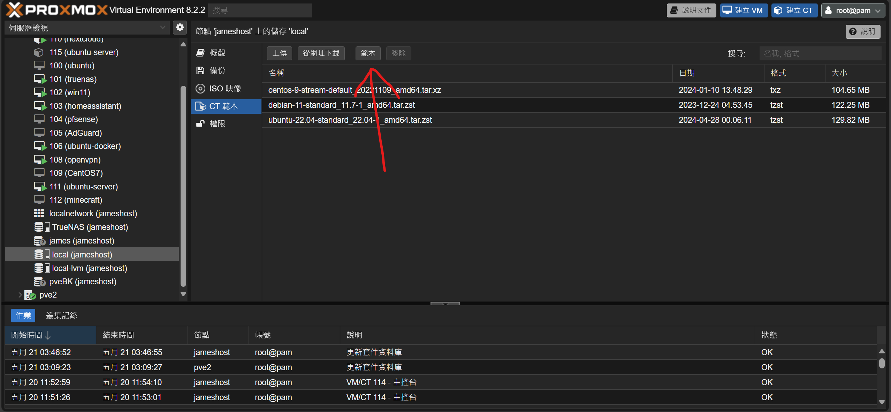

## 下載ubuntu 20

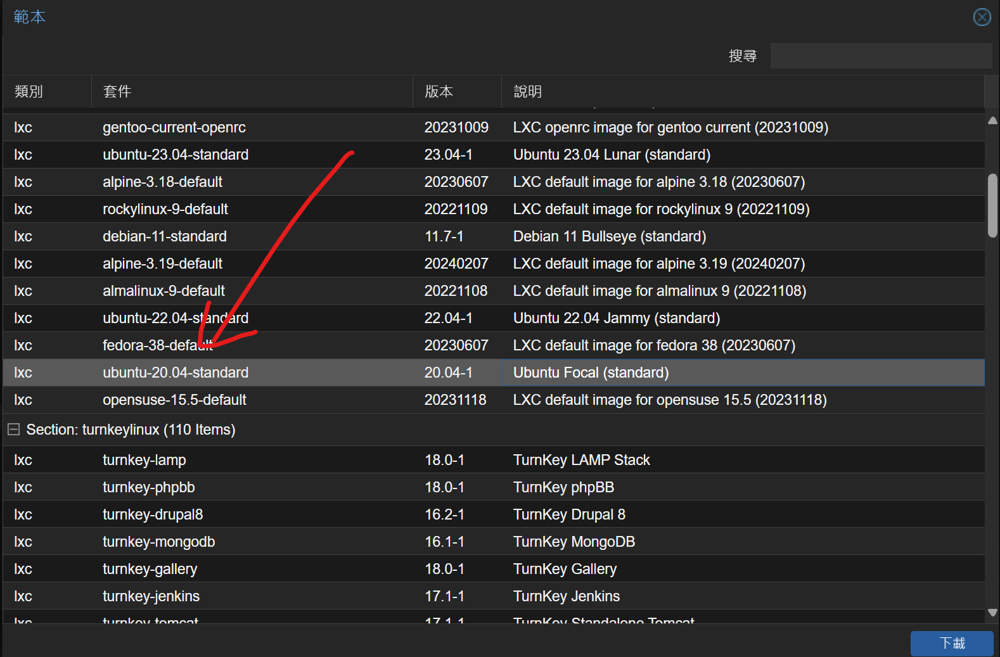

## 建立CT

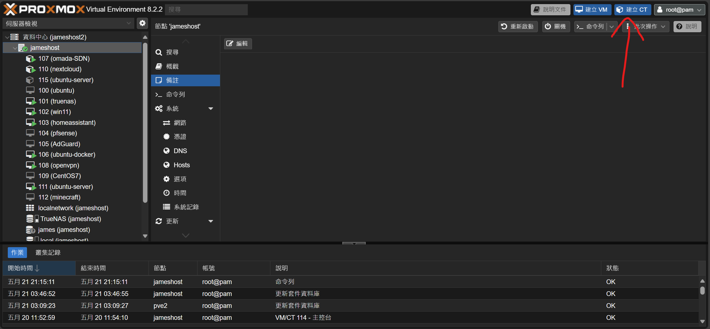

## 填入主機名稱、用戶密碼

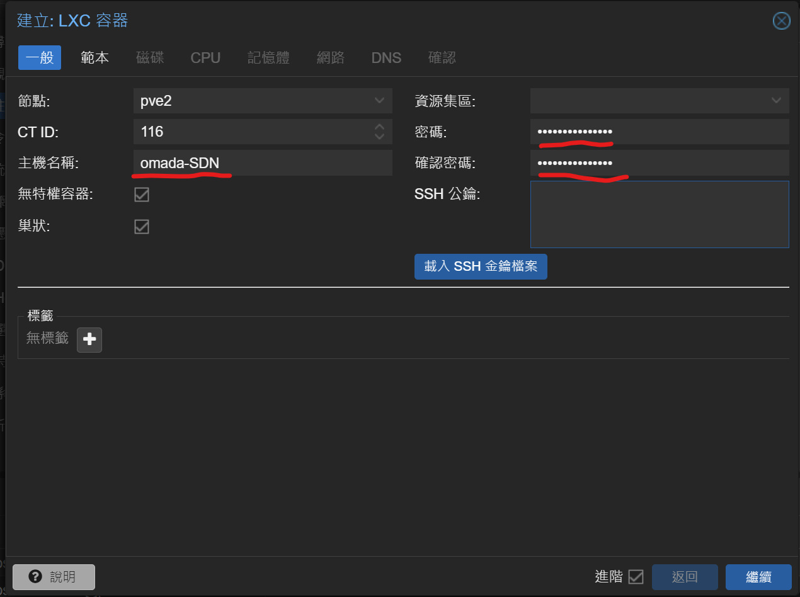

## 選擇剛剛下載好的範本

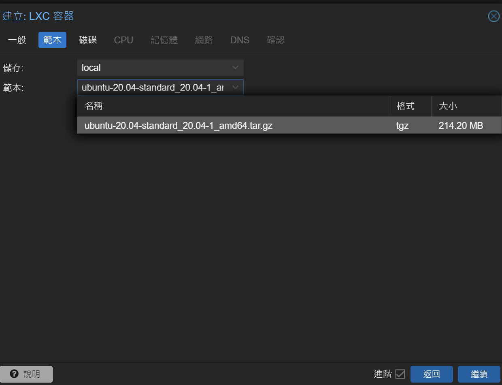

## 設定核心數和記憶體(建議2核2G)

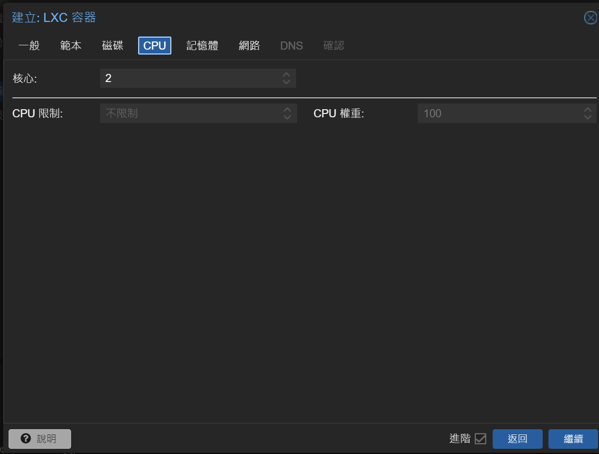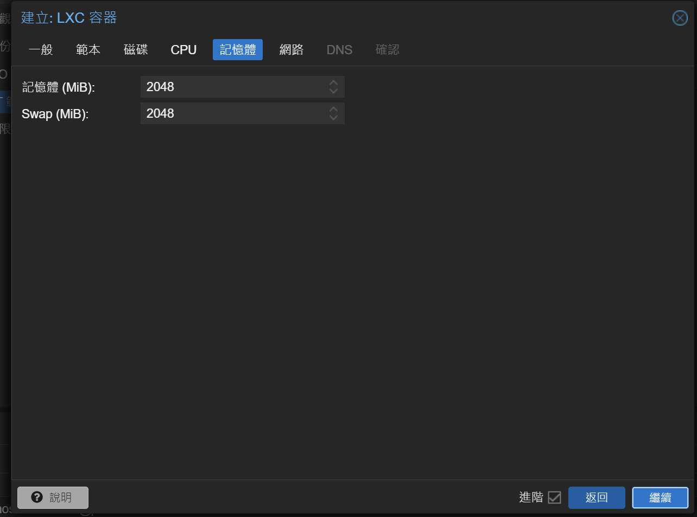

## 設定網路
把防火牆的選項取消勾選，根據自己路由器配置主機ip位置

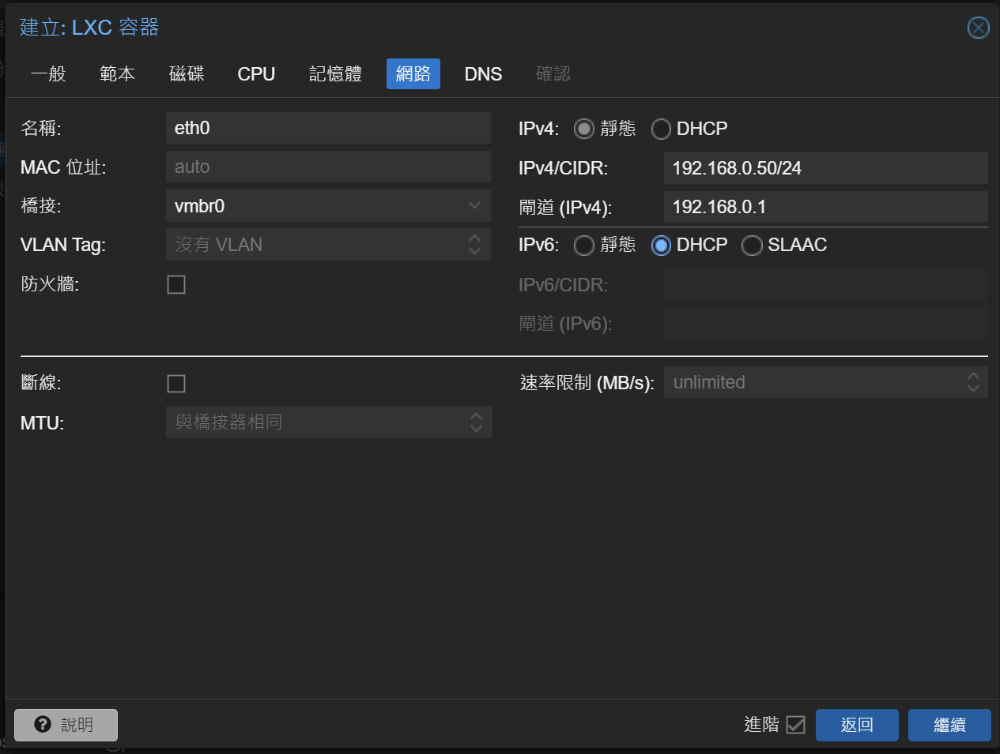

## 確認
確認好機器配置沒有錯

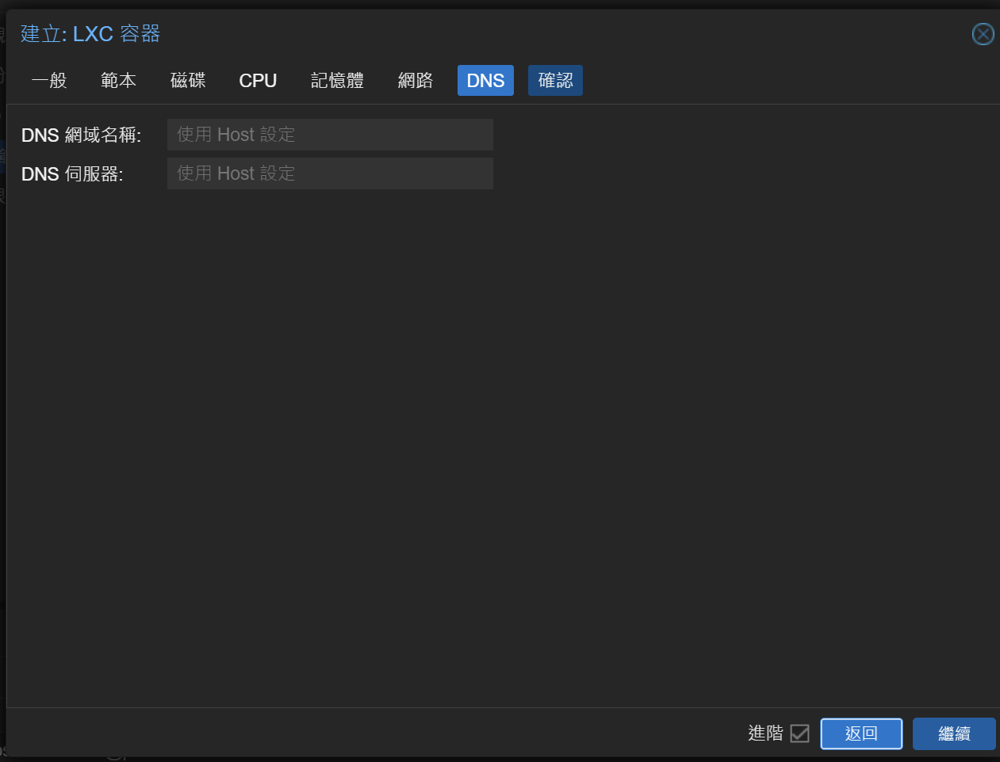

## 開機

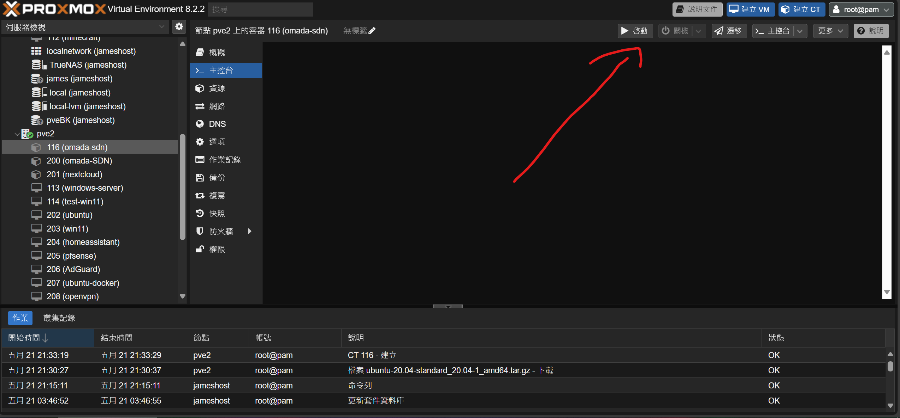
## 登入主機

帳號:root
密碼:<剛剛設定的>


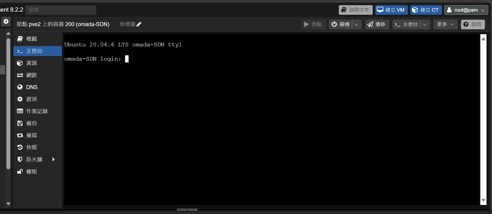
## 更新套件庫

sudo apt-get update
sudo apt-get upgrade

## 安裝必要套件

sudo apt-get install mongodb jsvc openjdk-8-jdk gdebi-core -y

## 設定java預設執行版本

sudo update-alternatives --config java

## 下載Tp-link執行腳本

wget https://static.tp-link.com/upload/software/2023/202303/20230321/Omada_SDN_Controller_v5.9.31_Linux_x64.deb

## 安裝Tp-link執行腳本


    gdebi Omada_SDN_Controller_v5.9.31_Linux_x64.deb


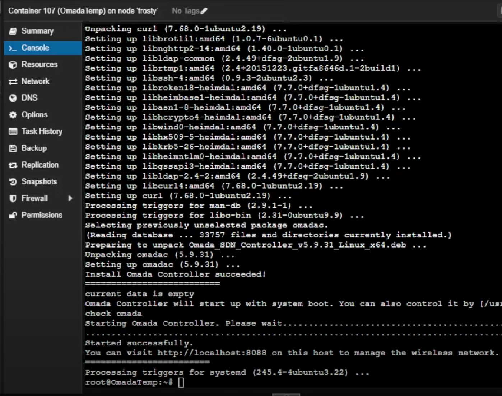
## 進入設定網頁
**安裝完成後進入**
`http://<你的ip>:8088`
進入後網頁如果顯示不安全選擇進階-->繼續前往網站

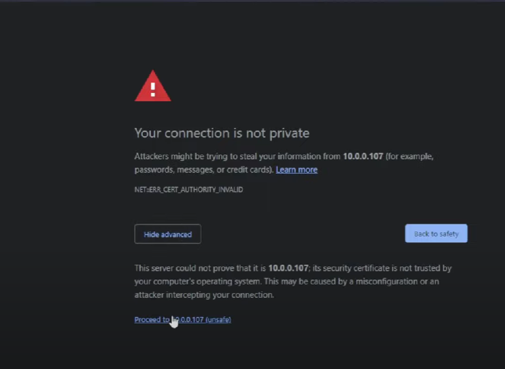

## 開始設定
**輸入基本資訊就大功告成拉~**

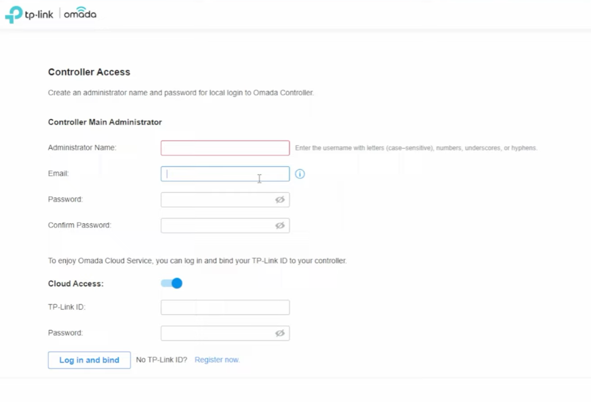

---
## 懶人包指令

    sudo apt-get update
    sudo apt-get upgrade
    sudo apt-get install mongodb jsvc openjdk-8-jdk gdebi-core -y
    sudo update-alternatives --config java
    wget https://static.tp-link.com/upload/software/2023/202303/20230321/Omada_SDN_Controller_v5.9.31_Linux_x64.deb
    gdebi Omada_SDN_Controller_v5.9.31_Linux_x64.deb
---
 

## 參考影片



 

