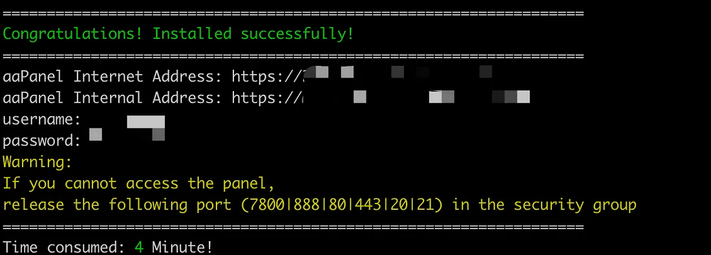
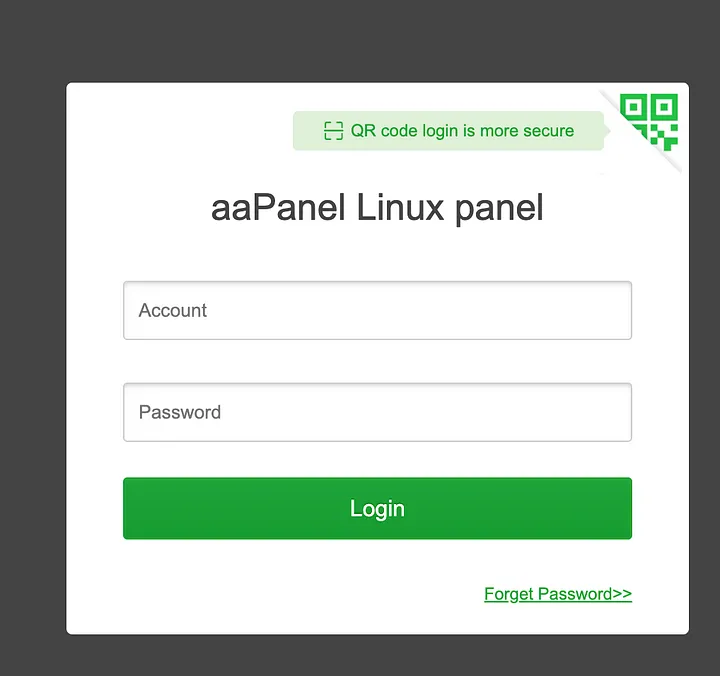

+++
title = '使用linux搭建aapanel'
date = 2024-08-17T00:53:25+08:00
draft = false
image = 'aapanel.png'
categories = [
    "linux"
]
tags = [
    "linux",
    "website"
]
+++

## 前言
這幾天想搭建一個typecho的blog，因為現在寶塔面板要登入帳號。
而寶塔面板跟aaPanel是一樣的，是不需要登入就可使用的，所以有了這篇教學。
>傳送門: https://www.aapanel.com/new/download.html#install

---
## 腳本快速安裝
- Ubuntu、centOS、Debian都可使用腳本
### 先切換成root

sudo -i


### 下載腳本並執行
複製執行即可(大約2~3分鐘左右)


URL=https://www.aapanel.com/script/install_7.0_en.sh && if [ -f /usr/bin/curl ];then curl -ksSO "$URL" ;else wget --no-check-certificate -O install_7.0_en.sh "$URL";fi;bash install_7.0_en.sh aapanel


## 安裝成功
> 記得上面有`用戶名和密碼`先複製起來保存
 

## 登入面板

---
## 基本操控

- 停止服務


service bt stop

- 開啟服務


service bt start


- 開啟服務


service bt start


- 解除安裝


service bt stop && chkconfig --del bt && rm -f /etc/init.d/bt && rm -rf /www/server/panel


## 結語
因為是通過 **面板安裝服務** 可能會等比較長的時間，這篇就到這邊結束拉~
