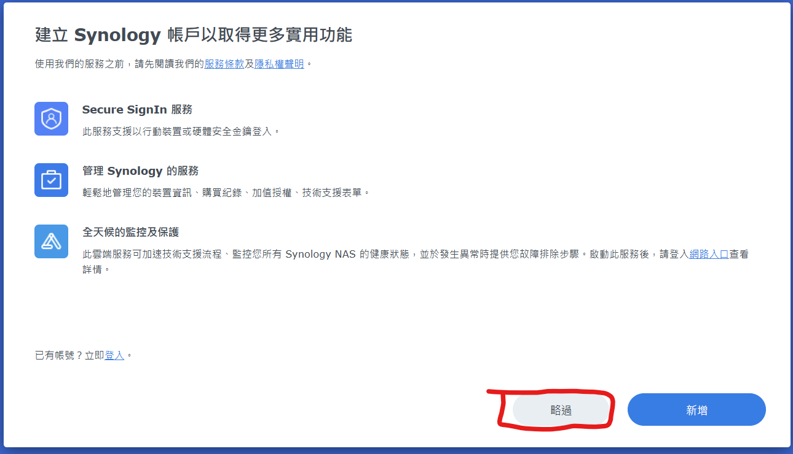

+++
title = '使用RR安裝黑群輝、黑群輝洗白'
date = 2024-09-04T21:44:41+08:00
draft = false
image = 'Synology_Logo.png'
categories = [
    "linux",
    "pve"
]
tags = [
    "linux",
]
+++

## 前言
本篇只教安裝，你可以先安裝好再去研究怎麼使用😂。
 
這篇是使用PVE安裝，如果要用實體機安裝，請到RR的Github下載`RR的img`[👆傳送門👆](https://github.com/RROrg/rr/releases/tag/24.8.6)使用rufus燒入開機，並跳到[步驟3](https://blog.jameshost.org/p/dsm/#安裝黑群輝)。直接看安裝即可。
 
這篇後面有給`DS920+的序號`我不知道有沒有時效性，如果你們用真的不行的話，那就可能沒辦法用了，但機器只要洗白一次就可以了。

> Q&A

1、什麼是`白群輝`？    群晖的硬件+群晖的系统
 
2、什麼是`黑群晖`？    DIY硬件+群輝的系统
 
3、什麼是`洗白`？  黑群輝透過改成和正版一樣的SN碼和MAC地址，偽裝成白群輝。
 

> 4、不洗白會`影響那些功能`？
>+ `QuickConnect`不能註冊和登入(這是一個群輝非常強大的內往穿透的功能)。
>+ `DS Photo/Moments`套件預覽圖是黑的。
>+ `DS Video`觀看只能選擇原碼，不能切換碼率，無法離線轉碼。
>+ `Virtual Machine Manager`虛擬機不能用。
>+ `Active Backup for Business`數據保護和備份不能用。
>+ `Advanced Media Extensions`高校影音編碼不能用。
>+ 主要是影響需要登入群輝帳號和需要授權的服務。

---

## pve配置

### VM

建立VM選擇`不要只用任何媒體`

---

### 系統
系統可用`預設`就好

---

### 硬碟
磁碟選擇`SATA`並依照自己需求調整空間

---

### CPU
CPU類別選擇`host`，記憶體建議2G以上。

---

### 網路

網路防火牆`取消勾選`，型號選擇`E1000`

---
### 下載img

到RR的Github下載`RR的img`[👆傳送門👆](https://github.com/RROrg/rr/releases/tag/24.8.6)

---

### 上傳到pve
使用winscp上傳img到pve的`root文件夾`中

---

### 導入機器

使用指令把img`導入到機器` (下方`機器ID`改成自己的)，要等出現`Successfully`才可以關閉ssh使窗喔 !

qm importdisk <機器ID> rr.img local-lvm


---

### 新增磁碟

導入後機器會出現一個`未使用的磁碟`左鍵點兩下編輯，使用SATA並新增磁碟。

---

### 直通硬碟
先列出機器上所有的磁碟，這時候會出現很多東西，不要慌張，

`只要找最上面ata開頭的`是你伺服器上接的SATA磁碟。

ls /dev/disk/by-id


### 直通指令
找到自己要直通的硬碟後`輸入直通指令`(下方磁碟ID改成自己的)，如果有`兩顆以上`作法是一樣的指令中的`-sata1要改成-sata2...以此類推`，根據你黑群輝的機型會有`不一樣`的最多硬碟數量。

qm set 112 -sata1 /dev/disk/by-id/<磁碟ID>


出現update代表`成功`。

---

### 開機順序
在機器選項-->開機順序把rr的磁碟`勾選`並`拉到第一項`。

---

## 安裝黑群輝

開機選擇`Cofigure loader`

---

### 進入網頁
使用瀏覽器`進入網址`並開始安裝

### 選擇型號
選單選擇`Choose a model`，型號選擇`DS920+`。

 

---

### 選擇DSM版本

版本選擇`7.2`。

---

### 編譯開機檔案
選擇`Boot the loader`，並等待編譯。

---

### 開機設定
編譯完後會自動跳轉到`Boot the loader`，直接開機。

---

### 設定
進入畫面中顯示的地址

---

### 安裝DSM
選自動獲取版本即可

 

---
### 清除磁碟
確認磁碟可以被清空，並輸入產品型號。

---

### 等待安裝
安裝完後會`自動重新開機`，開機跑完後大約還要再等待`5分鐘`網頁介面才會再跑出來(請耐心等待)。

---

### 初始化
開機後一樣進入http://<ip>:5000，並進行初始化

這邊根據`自己需求`設定。

---

### 更新
這邊可以選自動更新

---

### 不要登入
這邊<mark>選擇略過</mark>，因為我們還沒將機器洗白仕登入不了的

### 建立處存空間
這邊就根據自己需求設定

---

## 洗白
PVE安裝的話有額外步驟在文章最底部會說明。

### 重新開機
開機選擇`Cofigure loader`

---

### 進入網頁
使用瀏覽器`進入網址`。

### 選擇`Cmdline menu`

### 選擇`Define MAC/SN`

### 填入自己購買的sn和mac
這邊提供DS920+全洗白的SN和MAC

    SN：2040SBRD42CP2
    MAC1：001132CABFFF
    MAC2：001132CAC000

`確認`&rarr;`退出`&rarr;`重新啟動`即可自動保存SN和MAC。

> 到這邊洗白就完成拉 ! 

----

## 測試
進入群輝系统登入群輝帳號`驗證是否可用`。

選擇`控制台`&rarr;`Synology帳戶`，登入帳戶。

---
### 測試quickconnect 
選擇`控制台`&rarr;`外部存取`&rarr;啟用`QuickConnect`，登入帳戶。

---
### 測試`Advanced Media Extensions`
到套件中心安裝

---
## 補充
pve需要手動調整MAC地址(DS920+`需要兩張網卡`請自己新增)
進入機器硬體對`網卡點兩下左鍵`設定MAC地址。

    00:11:32:CA:BF:FF
    00:11:32:CA:C0:00

## 結語
這東西裝在虛擬機很簡單，但如果裝在實體機器會有支援性的問題，太老的平台又不能用，所以我選擇裝在PVE裡面。