+++
title = '建立 iRedMail 郵件伺服器(SMTP)'
date = 2024-08-15T00:21:01+08:00
draft = false
image = 'mail.jpg'
categories = [
    "linux"
]
tags = [
    "linux",
]
+++

## 更新系统

apt update -y


---
## 設置主機名
我們規劃郵局的網域名稱為 `mail.<你的網域>` ，所以，我們需要設定 linux 的主機名稱。
首先，需要編輯 `/etc/hosts` 文件，找到含有你的主機IP位址的那一行；如果沒有，則會新增一行。內容如下：

192.168.0.30 mail.<你的網域> mail


其中, 192.168.0.30 可換為你的伺服器 IP 位址，後面依序填入長主機名和短主機名，切記不可填反。
然後，我們找到 VPS 的 `/etc/hostname` 文件，編輯裡面的內容為 mail （網域的前綴）
這樣，就設定好了主機名稱。然後再`重啟主機`。

---
## 檢查一下是否設定正確：

執行：`hostname`

執行：`hostname -f`

此時，我們分別看到`mail` 和 `mail.<你的網域>`
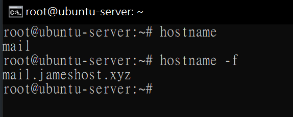 

這樣，我們就全部設定好了主機名稱（hostname）, 可以進行接下來的其他操作了。

---
## 下載並安裝 iRedMail

系統將會自動開始安裝。安裝過程中會出現以下這些情況，您需要依序根據您自己的資訊來設定。

    apt-get install git -y
    wget https://github.com/iredmail/iRedMail.git
    cd iRedMail
    bash iRedMail.sh

然後按下 <kbd>ENTER</kbd>，然後等待安裝。
### 第一步
歡迎介面，兩個選項，yes或no ，直接選`yes`。

 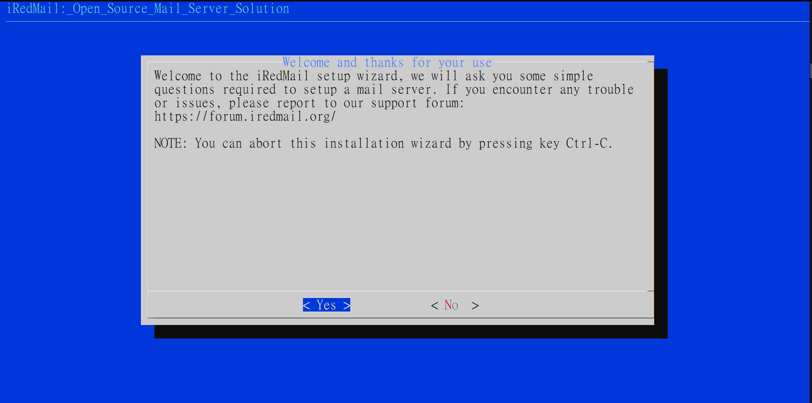
### 第二部
設定安裝目錄，這裡可以看到安裝目錄為`/var/vmail` 直接 <kbd>ENTER</kbd>，下一步。

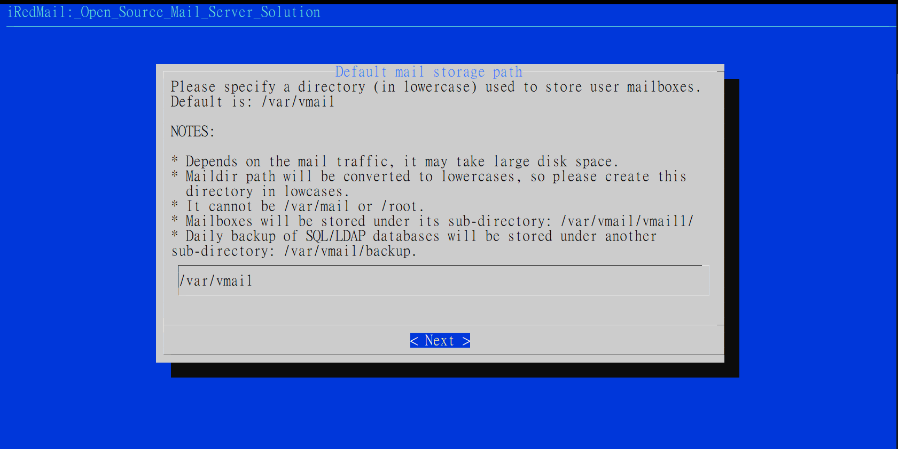
### 第三步
選擇web伺服器，此時可以看到nginx前面有個星號，這代表已經被選中，如果沒有星號，切換到`nginx`選項，按一下空格，星號出現， <kbd>ENTER</kbd> 下一步。

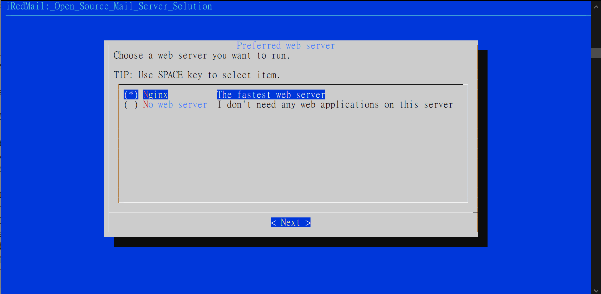
### 第四步
選擇資料庫，上下選擇到`MariaDB` ，空格星號選中，<kbd>ENTER</kbd>下一步。

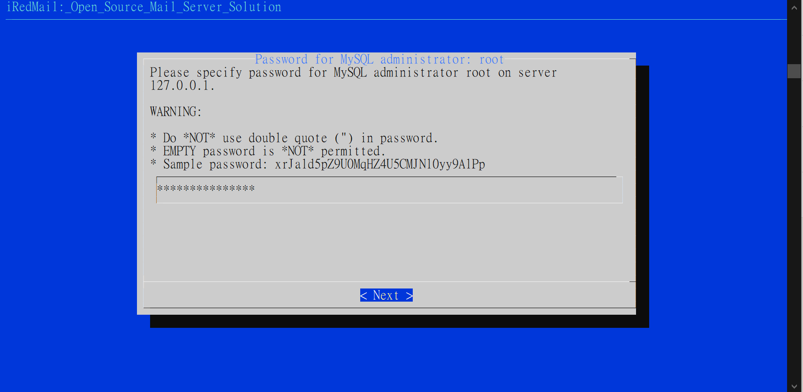
### 第五步
設定資料庫密碼，自己設定。

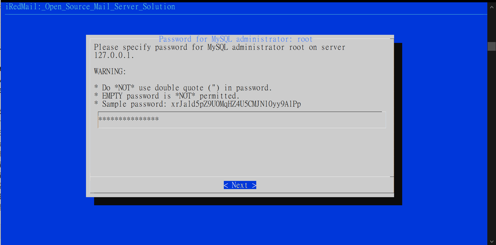
### 第六步
設定網域，不帶**網域前綴mail**，我這邊是`jameshost.xyz`。

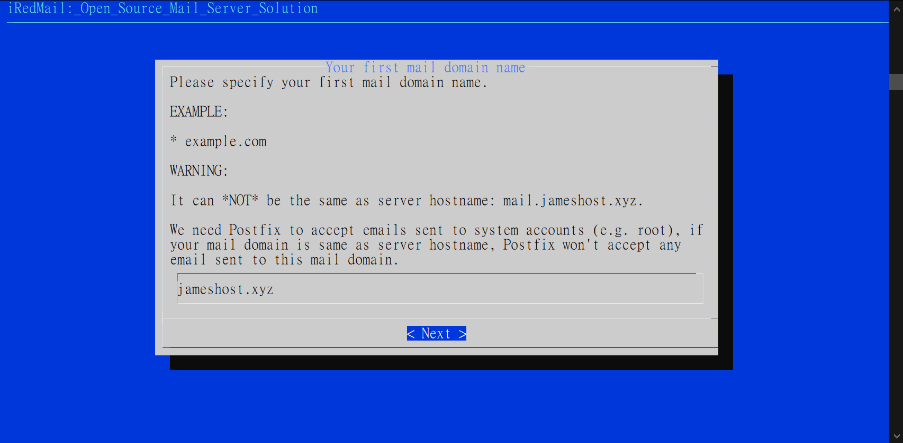

### 第七步
設定管理員密碼

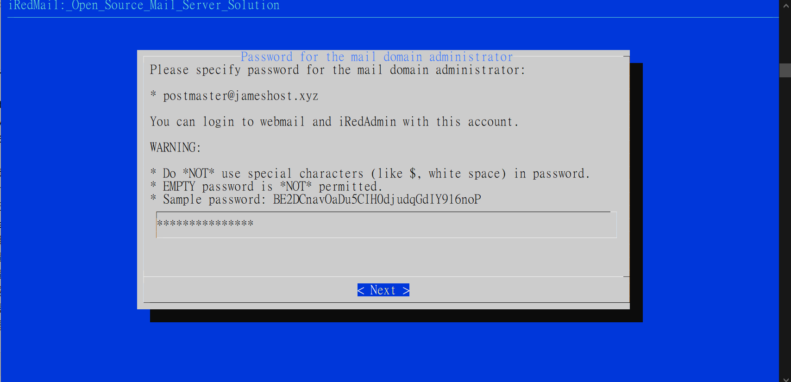
  
### 第八步
選擇需要安裝的組件，預設即可，那個Sogo可裝可不裝，都可以，不影響郵件服務，<kbd>ENTER</kbd>下一步。

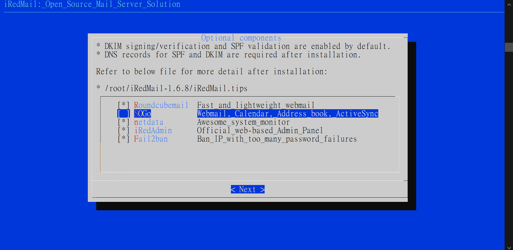
### 第九步
確定設定無誤(`Y確認N取消`)

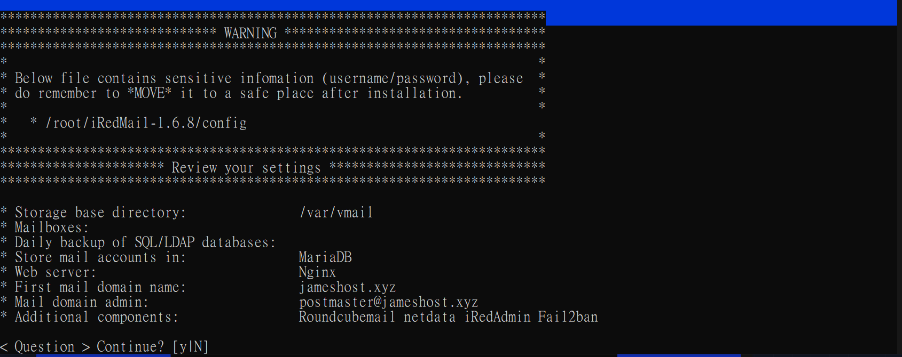

安裝大約需要10分鐘左右。全部安裝好之後，系統會提示是否設定防火牆規則，我們輸入y確認即可。
**重啟伺服器，讓郵件伺服器生效！** 至此，郵件伺服器搭建完畢，以下開始設定郵件伺服器。

## 設定郵件伺服器
    可以透過存取（當然，我們目前還沒有解析域名，後面在一起解析）
    https://你的網域/mail ——郵件登入位址
    https://你的網域/netdata ——伺服器狀態監控
    https://你的網域/iredadmin ——郵件伺服器後台管理
    管理員帳號：postmaster@你的網域 例如 postmaster@jameshost.xyz
    管理者密碼：安裝時候設定的密碼
    以上訊息，可以在 /root/iRedMail-1.6.3/iRedMail.tips 檔案中查看

---

## 配置 DNS 及解析
您需要設定一條TXT記錄，將根網域名稱（例如我這裡的jameshost.org）解析值設定如下。

內容為

v=spf1 mx ~all


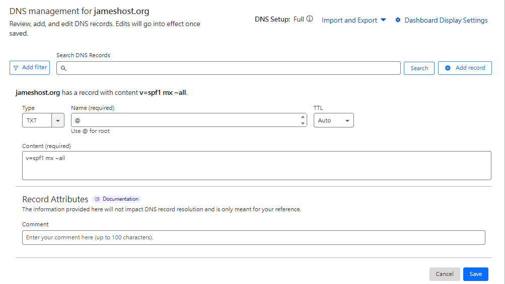
<!--more-->
---

### 設定 MX 紀錄
建立一個名為根域名解析到郵件伺服器的ip

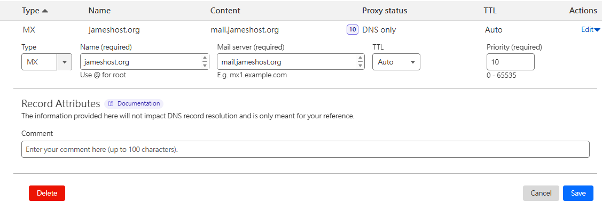

---
### 設定 DMARC 紀錄
DMARC記錄的設定比較複雜，這裡簡單設定一下，對於普通的網域郵件已經足夠使用了。您需要新增一則TXT記錄，將_dmarc.jameshost.org `不要遺漏dmarc前面的那個底線`解析值設定為如下：

v=DMARC1; p=none; pct=100; rua=mailto:dmarc@<你的網域>


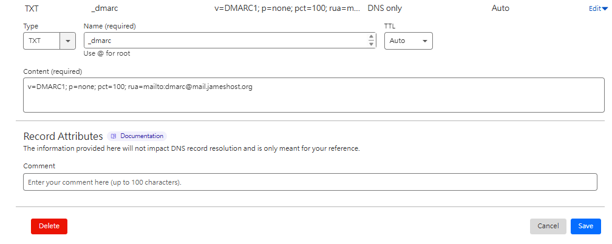

---
### 設定 DKIM記錄

在配置DKIM記錄之前，我們先要產生DKIM金鑰。在SSH中執行：


amavisd-new showkeys


會看到類似下面的密鑰：

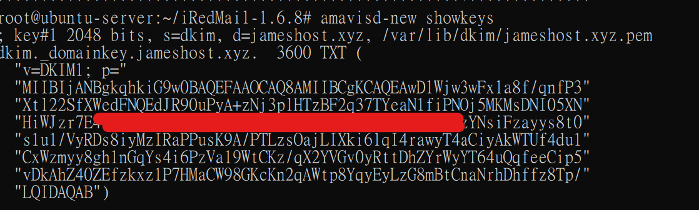

然後，以網域jameshost.xyz為例，請去您的`cloudflare DNS`那裡，新增一條`TXT記錄`，

將`dkim._domainkey.jameshost.xyz`解析到`v=DKIM1; p=MIIBIj…………………… ………………h6o3Lv7OoNd`。

請注意，這裡的解析值不包含`小括號以及所有引號`。

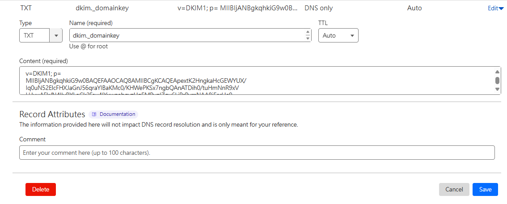

---

## 申請證書

安装證書工具certbot

apt-get install certbot -y


然后，申請免費的Let’s Encrypt證書：


certbot certonly --webroot -d mail.<你的網域> -w /var/www/html/


申請期間會叫你輸入`電子郵件地址`
然後根據提示`輸入Y`，然後他會問你要不要接收廣告郵件`輸入N`不同意。
    
    公鑰路徑: /etc/letsencrypt/live/mail.<你的網域>/fullchain.pem

    私鑰: /etc/letsencrypt/live/mail.<你的網域>/privkey.pem

配置證書
----
**申請完畢後，我們先設定Nginx.**
編輯檔案`/etc/nginx/templates/ssl.tmpl`, 找到下面兩行：

    ssl_certificate /etc/ssl/certs/iRedMail.crt;
    ssl_certificate_key /etc/ssl/private/iRedMail.key;
將地址更換為**您的證書地址**：

    ssl_certificate /etc/letsencrypt/live/mail.<你的網域>/fullchain.pem;
    ssl_certificate_key /etc/letsencrypt/live/mail.<你的網域>/privkey.pem;
保存好後重新载入Nginx配置文件：

service nginx reload


收發郵件時，同樣需要用到TLS安全認證，因此我們還需要配置Postfix和Dovecot. 首先，編輯`/etc/postfix/main.cf`文件，找到下面這三行（第95 ~ 97行）：

    smtpd_tls_key_file = /etc/ssl/private/iRedMail.key
    smtpd_tls_cert_file = /etc/ssl/certs/iRedMail.crt
    smtpd_tls_CAfile = /etc/ssl/certs/iRedMail.crt
將其替換為您的憑證地址：

    smtpd_tls_key_file = /etc/letsencrypt/live/mail.<你的網域>/privkey.pem
    smtpd_tls_cert_file = /etc/letsencrypt/live/mail.<你的網域>/cert.pem
    smtpd_tls_CAfile = /etc/letsencrypt/live/mail.<你的網域>/chain.pem
儲存好之後重新載入Postfix設定檔。

service postfix reload


最後，給Dovecot配置憑證。編輯檔案`/etc/dovecot/dovecot.conf`, 找到下面這兩行（第45和46行）:

    ssl_cert = </etc/ssl/certs/iRedMail.crt
    ssl_key = </etc/ssl/private/iRedMail.key
將其替換為您的憑證地址：

    ssl_cert = </etc/letsencrypt/live/mail.<你的網域>/fullchain.pem
    ssl_key = </etc/letsencrypt/live/mail.<你的網域>/privkey.pem
儲存好之後重新載入Dovecot設定檔。

service dovecot reload


**這樣，我們為Nginx, Postfix, Dovecot分別配置好了SSL/TLS安全性憑證。**
我們先給設定檔提升權限：

chmod +w /opt/iredapd/settings.py


然後編輯該檔案`/opt/iredapd/settings.py`，找出下面這行：

    plugins = ["reject_null_sender", "wblist_rdns", "reject_sender_login_mismatch", "greylisting", "throttle", "amavisd_wblist", "sql_alias_access_policy"]

將其中的`”greylisting”`這項刪去即可。然後，重啟iredapd, 並且恢復檔案權限。

service iredapd restart
chmod -w /opt/iredapd/settings.py


---------

## 開始設定
 進入`https://<你的網域>/iredadmin`

 帳號密碼就是一開始安裝時設定的`postermaster@<你的網域>`

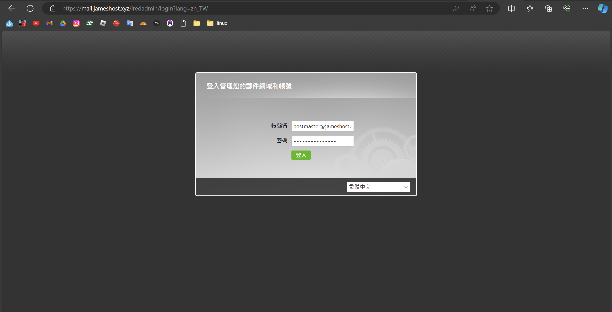

### 新增帳號

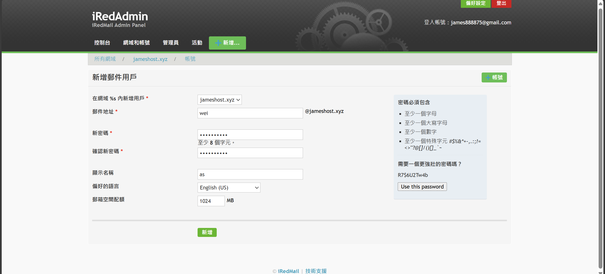
### 測試郵件收發
進入 `https://你的網域/mail` 登入郵件並填寫郵件測試，
如果是自家主機，測試前別忘了先`端口轉發`。

    SMTP: 25/587, POP3: 110/995, IMAP: 143/993

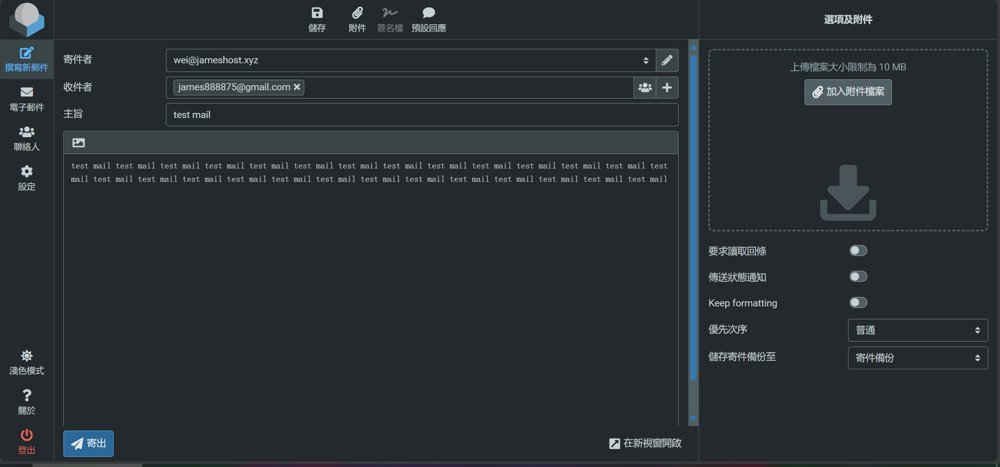
### 成功
收到確認有收到郵件就大功告成拉，
發送郵件可能會再垃圾郵件中按下`回報為非垃圾郵件`就可以了，
順便回信測試，如果回信沒有收到有可能是**端口轉發沒有成功**。

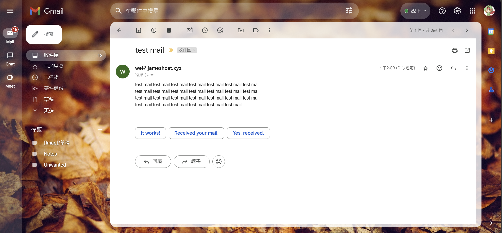

## 補充

如果您需要使用客戶端來收發信，則smtp, pop, imap位址均為mail.jameshost.xyz, 連接埠是常用的連接埠請自行轉發(SMTP: 25/587, POP3: 110/995, IMAP: 143/993).

> 有問題歡迎來私訊我的[instagram](https://www.instagram.com/su__tw87/)來討論 !