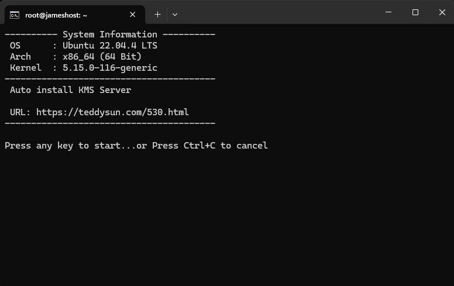
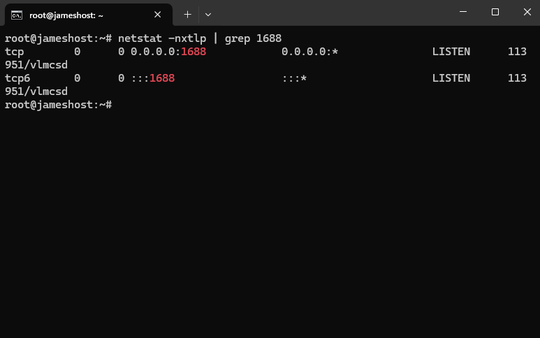

+++
title = '在linux架設KMS server'
date = 2024-08-18T03:51:01+08:00
draft = false
image = 'nonono.jpg'
categories = [
    "linux"
]
tags = [
    "linux",
]
+++

## 前言
使用 KMS (Key Management Service) 來啟用 Windows 可以是**合法**的，也可能是**盜版**，取決於具體的情況。

### ✅合法的情況：
企業授權：KMS 是 Microsoft 提供的一種啟用方式，主要針對`大型企業`、`教育機構`等，允許它們使用一個集中化的 KMS 伺服器來管理 Windows 和 Office 等產品的批量授權。這些企業和機構會`購買合法的批量授權`，並在內部使用 KMS 伺服器來啟用產品。
### ❌非法的情況：
破解工具：有些人可能會下載和使用非法的 KMS 激活工具（如 KMSAuto、KMSPico 等），這些工具使用`未經授權的 KMS 伺服器來欺騙 Windows`，以便免費啟用操作系統或軟體。這種方式被視為盜版，是非法的。
如果你使用的是來自合法來源的 KMS 伺服器並擁有適當的授權，那麼使用 KMS 是合法的。如果你使用的是未經授權的 KMS 伺服器或工具，`那麼這就是盜版`。

---
> # 如何架設KMS系統?

## 升級系統

sudo apt update && sudo apt upgrade


---
## 切換root使用者

sudo -i


---

## 使用腳本安裝
按任`意按鍵`繼續安裝，<kbd>CTRL</kbd> + <kbd>C</kbd> 取消

wget --no-check-certificate https://github.com/teddysun/across/raw/master/kms.sh && chmod +x kms.sh && ./kms.sh


---

## 安裝 `net-tools`

apt install net-tools


---
## 完成
安装完成后，輸入以下命令查看端口 1688 的監聽狀況

netstat -nxtlp | grep 1688


## 結語
測試請參考[這篇文](https://blog.jameshost.org/p/windwos%E5%95%9F%E7%94%A8%E8%BD%89%E6%8F%9B%E7%89%88%E6%9C%AC/)

再次聲明自行架設KMS是🛑`盜版`🛑!

