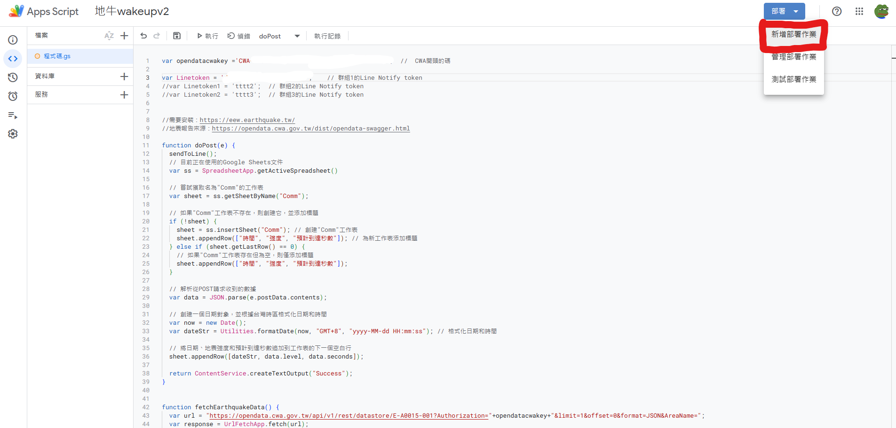

+++
title = 'LINE地震速報'
date = 2024-08-18T04:35:39+08:00
draft = false
image = 'deneo.png'
categories = [
    "windows"
]
tags = [
    "地震速報",
]
+++

## 前言
本篇介紹如何讓LINE通知地震、LINE地震速報，原理是透過 **地牛Wake Up!** 來觸發執行檔案，並透過GAS傳到 **Google Sheets** 做紀錄。

原作者: [傳送門](https://www.youtube.com/watch?v=UTIfhd1JfbM&t=1428s)

---
>## 需求
>- 能24h開著的windows電腦
>- LINE帳號
>- 耐心

---
>## 流程
>- 下載地牛Wake Up!
>- 取得氣象署 API
>- 取得Line Notify token
>- 部屬GAS
>- 下載BAT檔案
>- 設定地牛Wake Up!
>- 完成

---
> 如果你只想要發送通知不紀錄的話，跳到 `6.取得Line Notify token` ，
 
然後再跳到第`15.製作執行檔`，並填入**Line Notify token**就可以囉 !

---
## 地牛Wake Up!
先安裝`地牛Wake Up!` 👆[傳送門](https://eew.earthquake.tw/) 👆

---
## 中央氣象署開放資料平臺註冊
到中央氣象署開放資料平臺👆[傳送門](https://pweb.cwa.gov.tw/emember/register)👆註冊

---
## 取得授權碼
到中央氣象署開放資料平臺👆[傳送門](https://opendata.cwa.gov.tw/user/authkey)👆登入並取得`授權碼` (**CWA開頭的碼**)，先**複製保存**後面才會用到。

## 取得Line Notify token

進入👆[LINE Notify](https://notify-bot.line.me/my/)👆登入後選擇`個人頁面`

## 按下👆發行權杖👆

## 選擇要在哪裡發送訊息

## 複製tocken
先`複製保存`後面才會用到

---
## GAS部署
先進入👆[此連結](https://docs.google.com/spreadsheets/d/1wtwCsSuMBpfxVKOMfKnK8nHms4uVHzgwA4MbSrAWG2Y/edit?gid=0#gid=0)👆

左上角`檔案`-->`建立副本`

上方工具列`擴充功能`-->`Apps Script`

## 設置
填入上面取得的`氣象署API`和`Line Notify token`
其他請`自行設置`

## 部屬
選擇`新增部屬`

## 存取
設定為`所有人`然後按下`部署`

## 複製網址

## 製作執行檔
先下載檔案👆[點我下載](https://github.com/james788875/earthquake/archive/refs/heads/main.zip)👆，解壓縮後對檔案點`右鍵`-->`顯示其他選項`-->`編輯`，

在紅線處分別填入`氣象署API`和`Line Notify token`，

填入後記得 <kbd>CTRL</kbd>+<kbd>S</kbd> `保存`並退出。

## 設定地牛
到`地牛Wake Up!`的設定-->其他`連動設定`選取你剛剛保存的`earthquake.bat`

## 測試
按下`測試`，如果你的LINE有成功收到通知，

同時打開你的`google sheet`也有紀錄，這說明你成功了 !✅

## 參考影片



 

## 補充

!!!!!!!!!!!!!!!!!!!!!!!!!!!!!!!`更改了之後就無法再改回需要重灌才能解決`!!!!!!!!!!!!!!!!!!!!!!!!!!!!!!!!!!!!

> 如果傳送通知中文會變亂碼，需要更改windwos的設定，
 
控制台-->時鐘和地區-->變更日期、時間或數字格式-->系統管理-->🛡️變更系統地區設定-->
 把Beta Unicode UTF-8打勾✅

!!!!!!!!!!!!!!!!!!!!!!!!!!!!!!`更改了之後就無法再改回需要重灌才能解決`!!!!!!!!!!!!!!!!!!!!!!!!!!!!!!!!!!!!

