+++
title = '如何在windows架設minecraft伺服器'
date = 2024-08-15T03:32:37+08:00
draft = false
image = 'minecraft.jpg'
categories = [
    "windows",
    "遊戲伺服器"
]
+++

## 前言 ##
此篇介紹如何使用windows環境架設官方minecraft伺服器。

## 安裝JAVA
**下載並安裝**
👆[JAVA](https://www.oracle.com/java/technologies/downloads/#jdk22-windows)👆
*點網址開始下載*

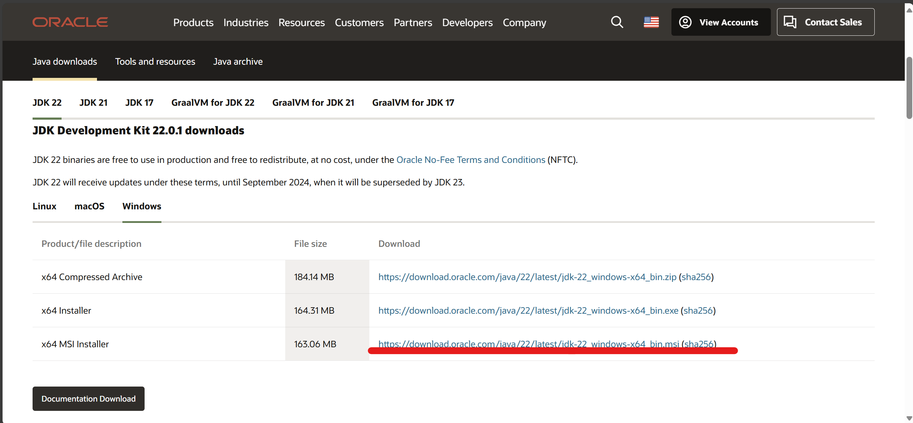

### 下一步
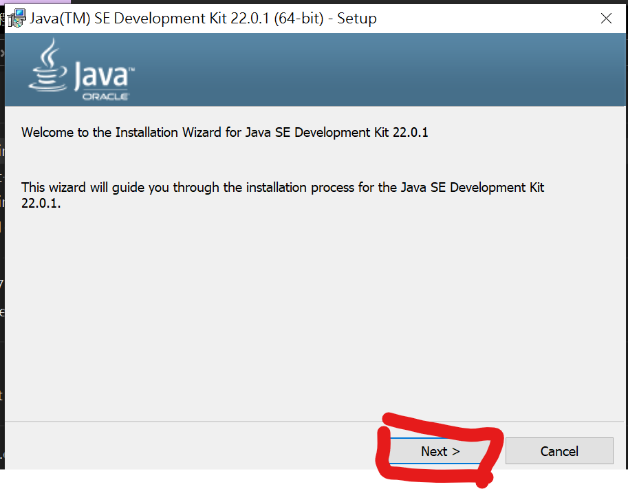
### 下一步
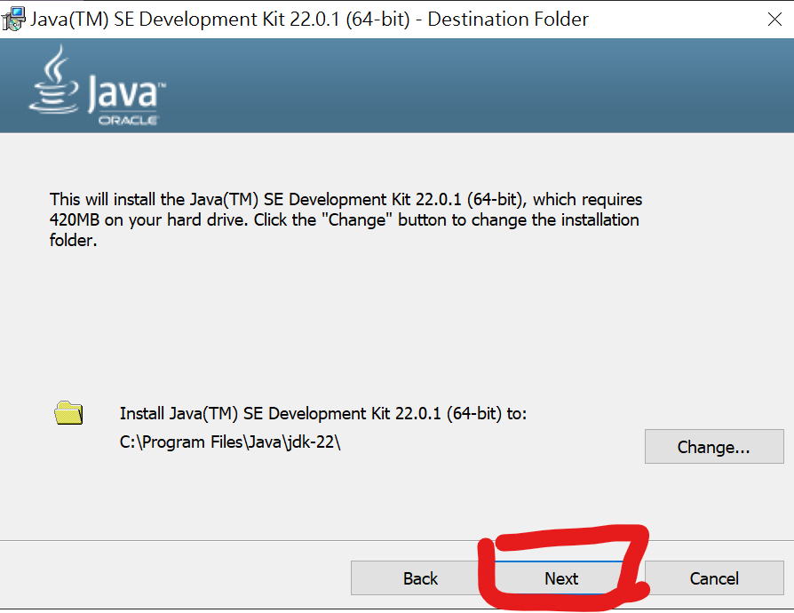
### 按close即可
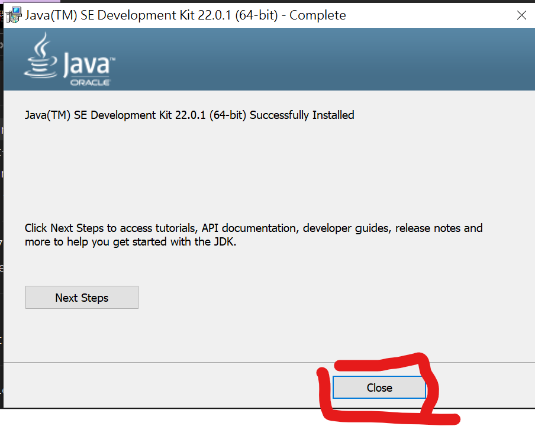

## 到官網下載伺服器檔案 
**到👆[minecraft官網](https://www.minecraft.net/en-us/download/server)👆下載伺服器檔案**
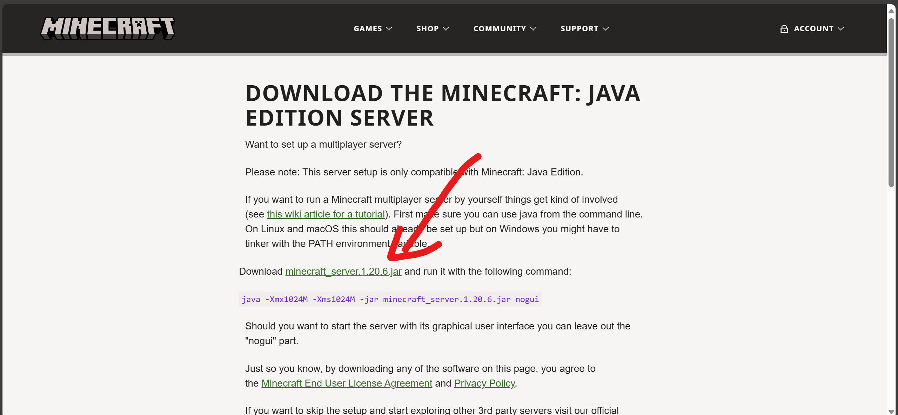

## 下載的檔案放到單獨的資料夾
**將下載的 server.jar 放到單獨的資料夾中(名字不能是中文)**
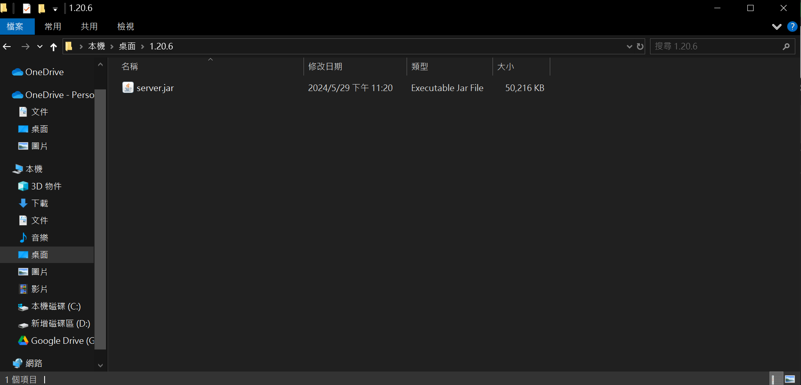

## 建立啟動檔案 ##
**建立啟動檔案**
打開 Windows 的記事本，先貼上下面這串指令，將存檔類型改成所有檔案，並將檔案名稱命名為 run.bat，儲存到有 server.jar 的資料夾中，最後點擊存檔

java -Xmx1024M -Xms1024M -jar server.jar nogui


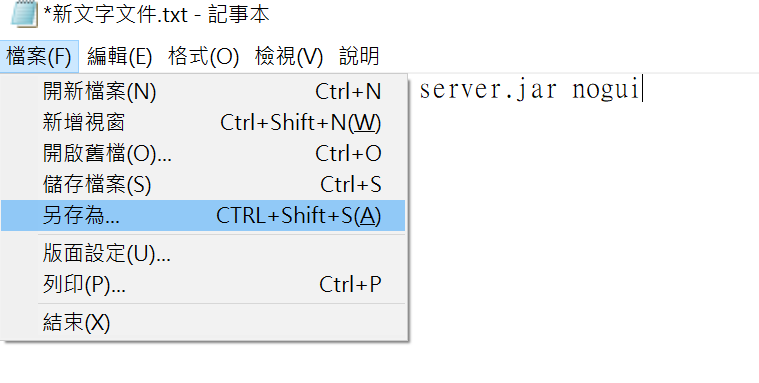
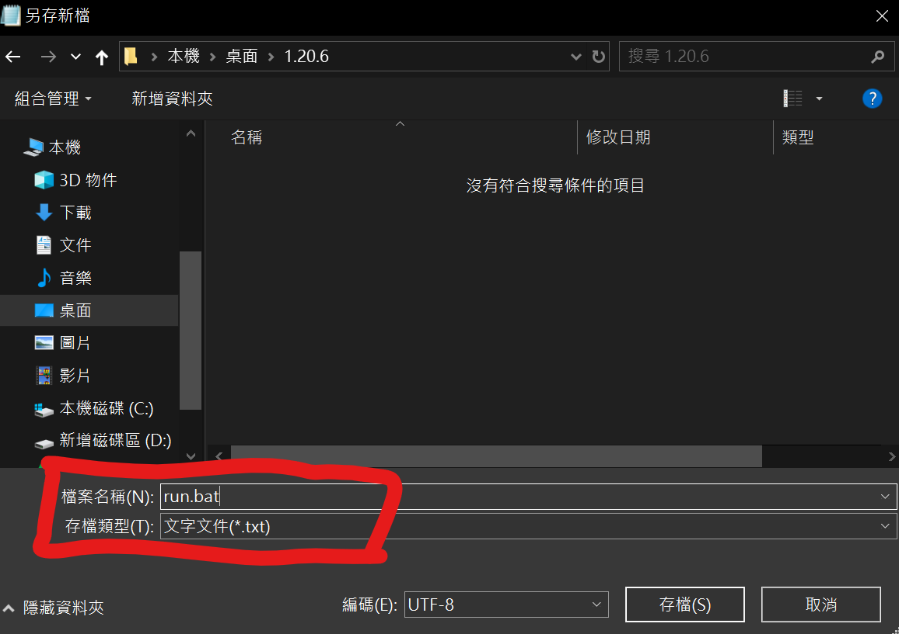

## 啟動伺服器 ##
**雙點擊 run.bat 來啟動伺服器，初次啟動時會先初始化，也會產生一些檔案。伺服器在 eula.txt 檔案出現後會自動關閉，這時我們可以用文字編輯器來打開 eula.txt**
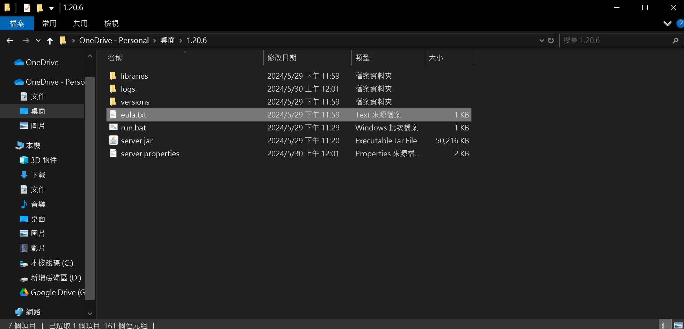
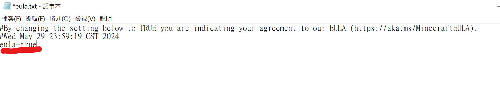

## 完成 ##
**我們先等待所有的 Preparing spawn area 都跑完後，會出現 Done! For help, type “help” 訊息，這代表伺服器已經準備好，我們可以連線進去玩了 !**
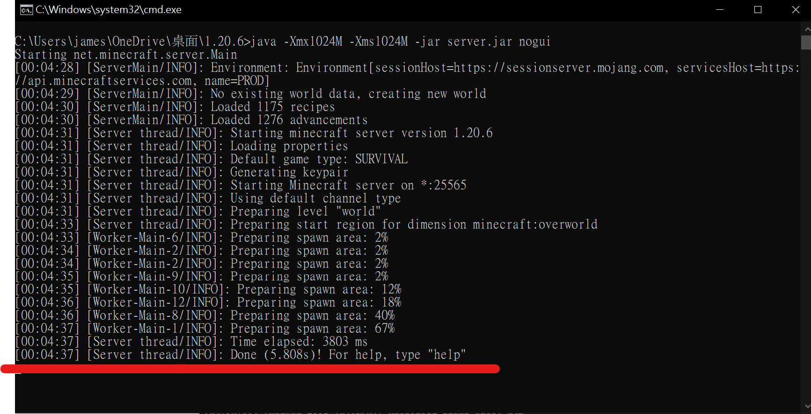

## 開啟minecraft ##
選擇多人遊戲

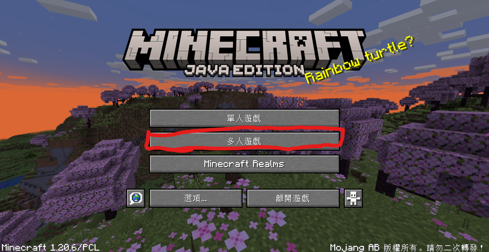

選擇新增伺服器

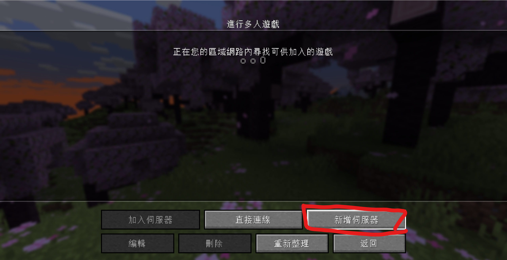

伺服器位址中輸入 127.0.0.1(本地電腦ip)，再點擊完成

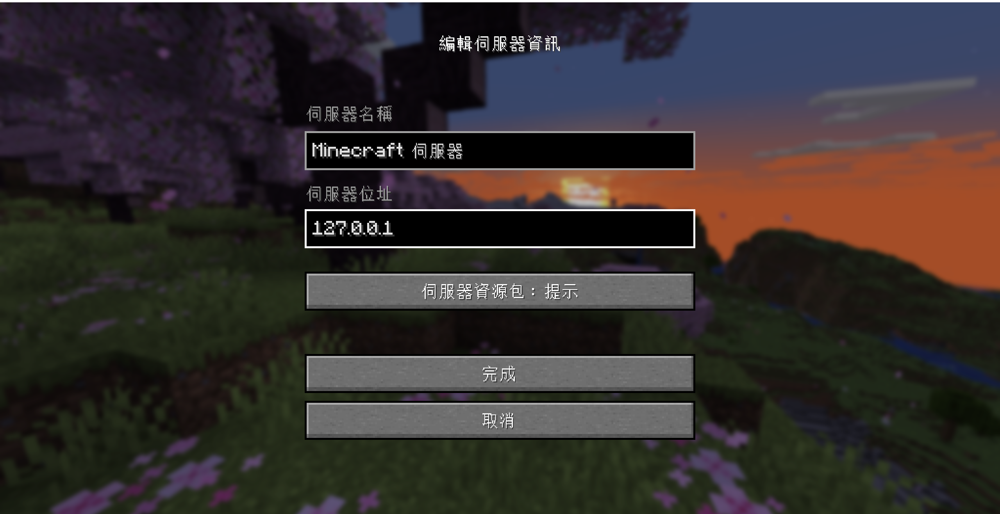

選取你的伺服器並點擊加入伺服器，即可進入伺服器

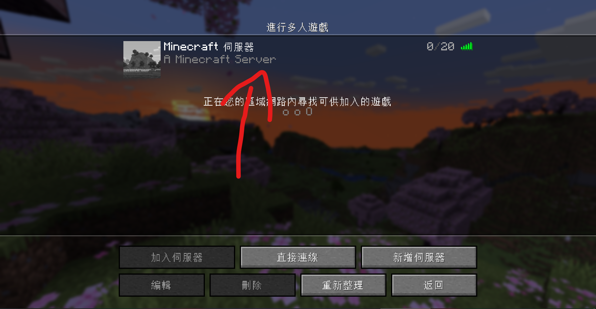

## 補充 ##
**如果想要開放給不是正版的人遊玩的話就需要做此步驟**
到伺服器檔案中找到server.properties的檔案，右鍵點擊開啟檔案(使用自己喜歡的文字編輯器)

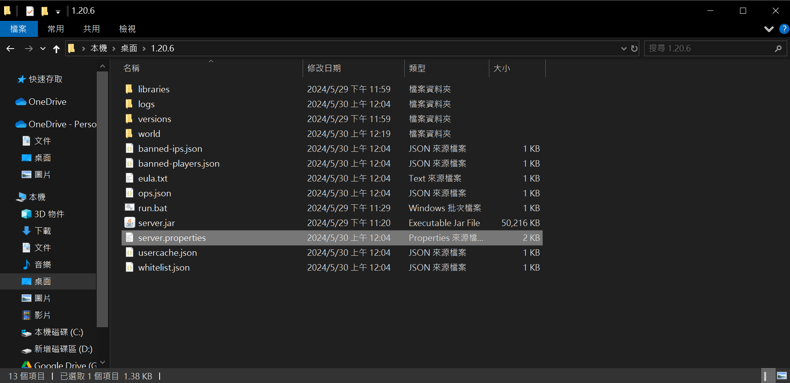
找到online-mode這行，把它改成false，並重新啟動伺服器就可開心地遊玩拉~

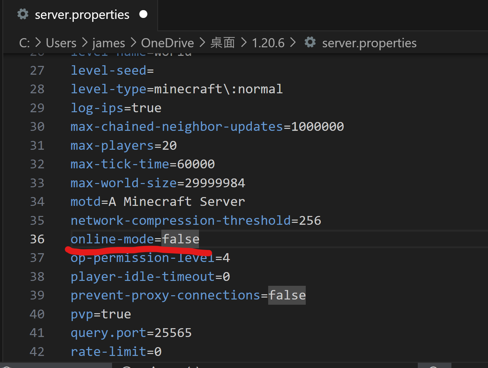

