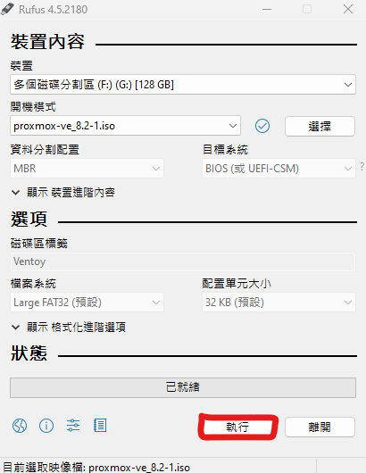
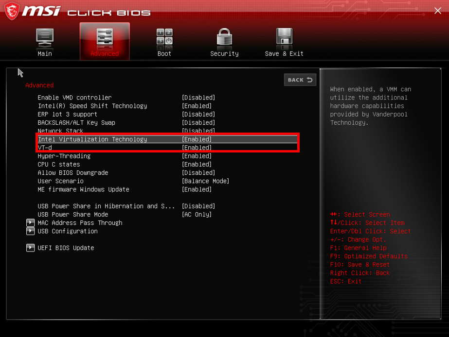
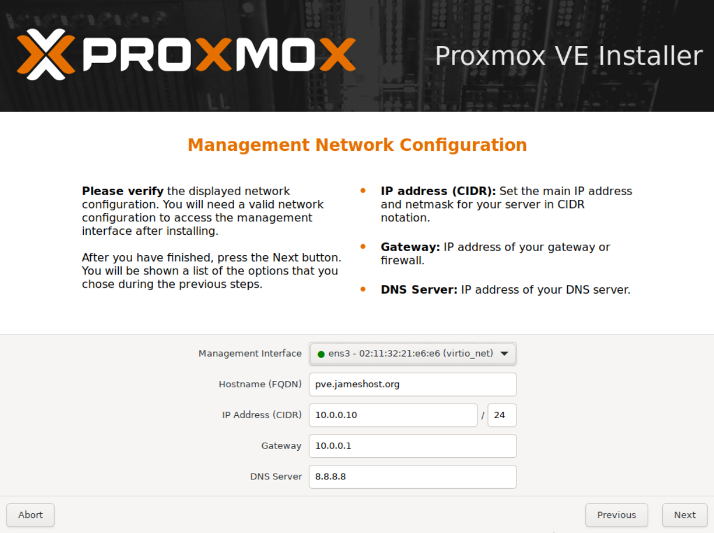
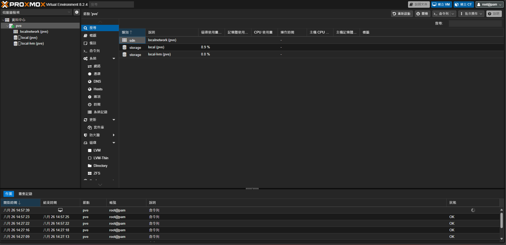
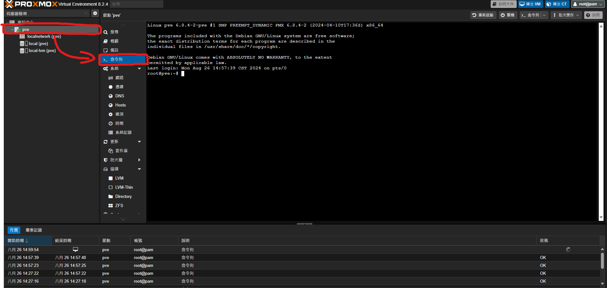

+++
title = '部屬新PVE環境並換源移除訂閱視窗'
date = 2024-08-26T14:12:57+08:00
draft = false
image = 'pve.jpg'
categories = [
    "pve",
    "linux"
]
tags = [
    "linux",
]
+++

## 前言
最近想把我的機器重新弄一次順便紀錄一下我做了些什麼，這篇介紹如何安裝並初始化你的pve，包括刪除訂閱警告視窗、換pve源。

---

## 準備工作
+ 2G 以上的隨身碟

+ 下載寫入工具 [👆rufus👆](https://github.com/pbatard/rufus/releases/download/v4.5/rufus-4.5.exe) 

+ 下載[👆Proxmox VE ISO👆](https://www.proxmox.com/en/downloads)
 
---

## 安裝PVE
選擇你的ISO和USB直接按下執行

---

### 設定第一啟動項
插入隨身碟到你的機器，打开 BIOS 界面，根據主機板的類型，設定第一啟動為隨身碟

> 請在BIOS中開啟`VT-d`和`VT-x`和`SR-IOV`每家主機板廠商開啟方式不一樣，這部份自己去google找關鍵字。

MSI主機板請參考這邊 [圖片來源](https://tw.msi.com/faq/faq-5390)

---

### 安裝系統
安裝部分就自行設定。

---

### 設定 pve
瀏覽器你的機器 IP+端口：`https://ip:8006` （注意是 HTTPS ），進入 PVE 管理界面。

---

## 換源
到shell視窗

---

> ### 方法一 
> 使用腳本

複製直行即可

wget https://cloud.jameshost.org/d/script/yuan.sh?sign=hUWplOxT3d9w6UrV5ZYBccCDONsJ7pIcRvOftUm0eF8=:0 -O yuan.sh && chmod +x yuan.sh && ./yuan.sh


然後在執行，就完成拉~

apt update && apt dist-upgrade


----

> ### 方法二 
> 手動換源

先刪除`sources.list.d`

rm -rf /etc/apt/sources.list.d/


然後換源 (可以全部一起複製)

echo "deb https://mirrors.ustc.edu.cn/debian/ bookworm main contrib non-free non-free-firmware" > /etc/apt/sources.list
echo "deb https://mirrors.ustc.edu.cn/debian/ bookworm-updates main contrib non-free non-free-firmware" >> /etc/apt/sources.list
echo "deb https://mirrors.ustc.edu.cn/debian/ bookworm-backports main contrib non-free non-free-firmware" >> /etc/apt/sources.list
echo "deb https://mirrors.ustc.edu.cn/debian-security bookworm-security main" >> /etc/apt/sources.list
echo "deb https://mirrors.ustc.edu.cn/proxmox/debian bookworm pve-no-subscription" >> /etc/apt/sources.list


最後在執行，就完成拉~

apt update && apt dist-upgrade


## 刪除訂閱視窗
執行完成後瀏覽器 <kbd>CURL</kbd>+<kbd>F5</kbd> 清緩存。

sed -Ezi.bak "s/(Ext.Msg.show\(\{\s+title: gettext\('No valid sub)/void\(\{ \/\/\1/g" /usr/share/javascript/proxmox-widget-toolkit/proxmoxlib.js && systemctl restart pveproxy.service


## 直通PCIE設備
直通部分比較複雜這邊附上影片可參考


---