+++
title = '如何安裝Office並啟用'
date = 2024-08-17T03:16:03+08:00
draft = false
image = 'office-header.jpg'
categories = [
    "windows",
]
tags = [
    "kms",
]
+++

## 前言
安裝`office`的方法有很多種，我選了一個比較簡單的方式

本篇是透過`Office Tool Plus`來進行安裝

---
## 開始安裝
先到官網下載👆 [Office Tool Plus](https://otp.landian.vip/zh-tw/download.html)👆

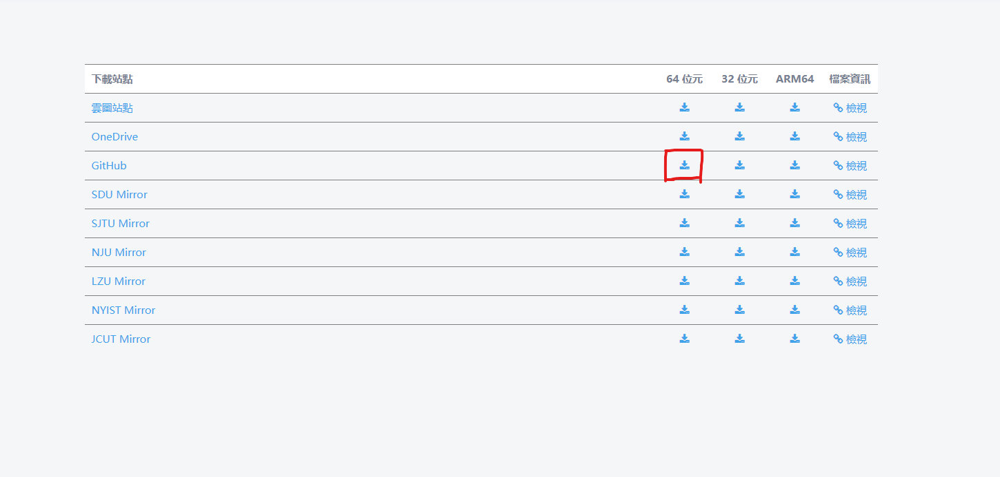

---
### 開啟檔案
`解壓縮後`並開啟檔案

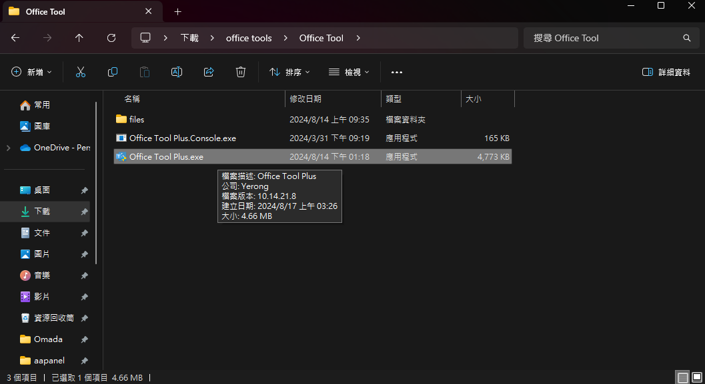

---
如果跳出`Windows以保護您的電腦`按 其他資訊-->扔要執行

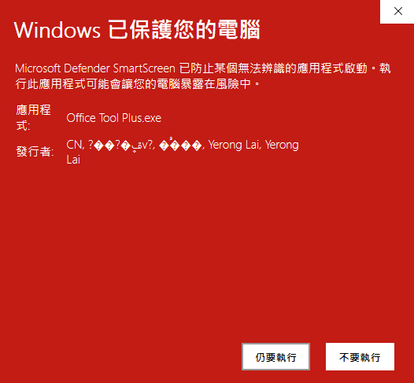

---

### 選擇部署
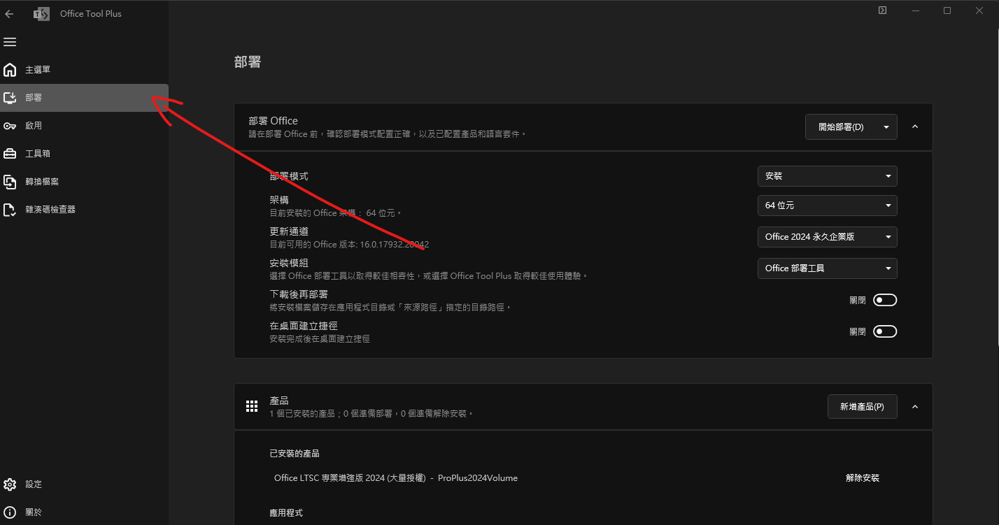

---

### 基本設定
> 架構`根據自己系統`選擇
> 更新通道選擇`2024永久企業版`

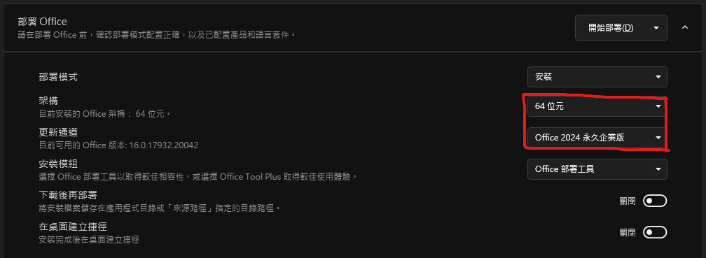

### 選擇產品
> 新增產品並選擇`Office LTSC 專業增強版2024(大量授權)`

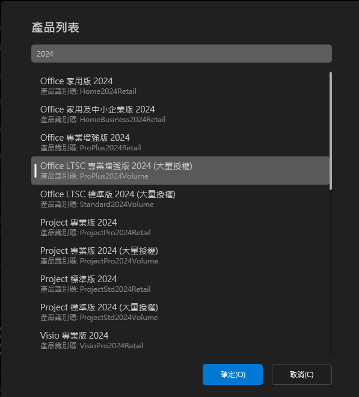

### 選擇語言
> 語言選擇`繁體中文`

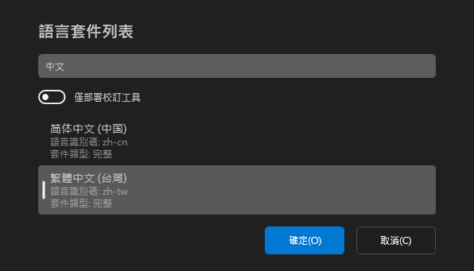

---
### 開始部署
- 確認`設定無誤`後，會開始下載

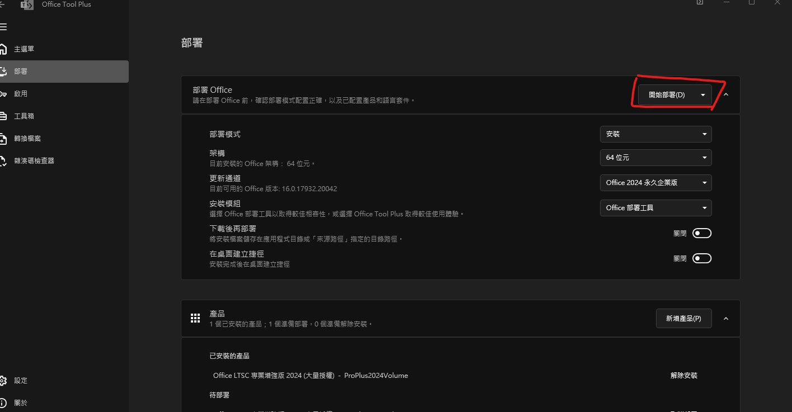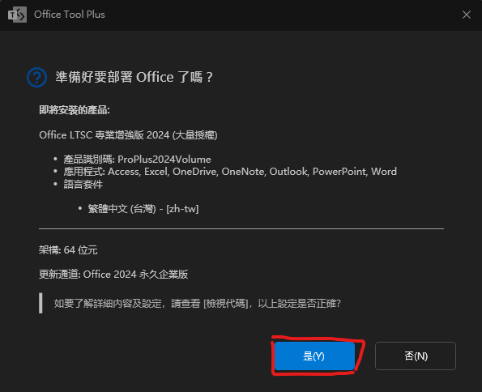

---
### 開始下載
- 下載完成`關閉`即可

---
### 確認
> 先關閉`Office Tool Plus`並打開`word`
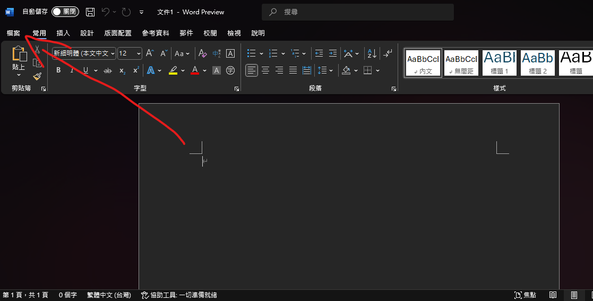

> 選擇帳戶後，這邊就可以`把word先關掉`
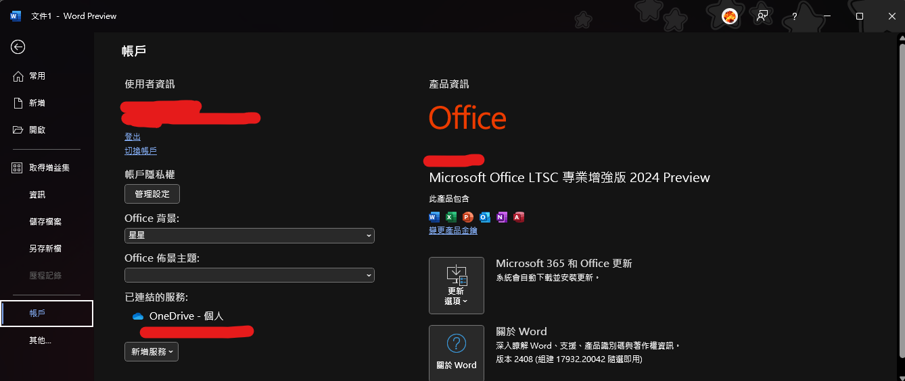

---
## 重新開啟 `Office Tool Plus`
- 選擇啟用

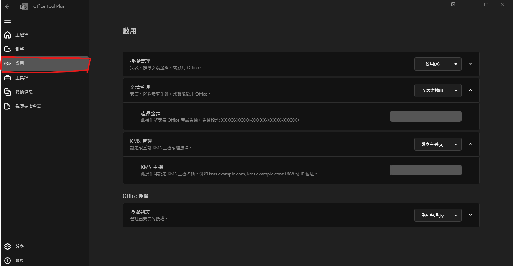

---
## 安裝授權
- 選擇`安裝`

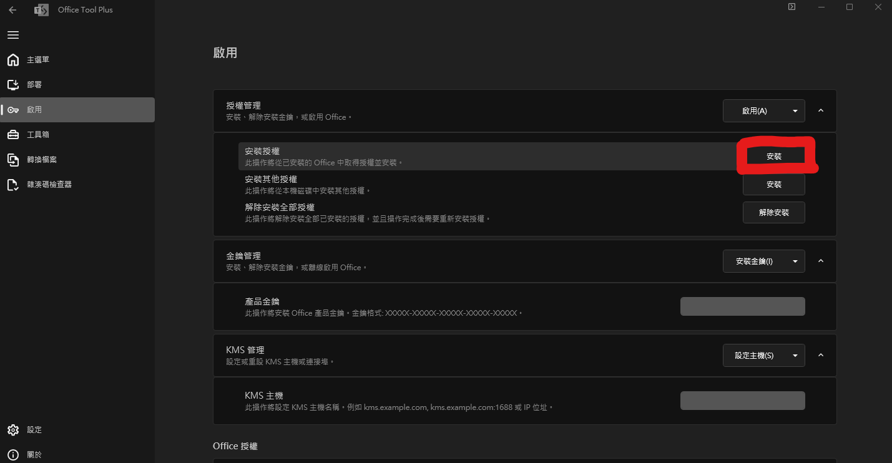

- 選擇`Office LTSC 專業增強版2024(大量授權)`

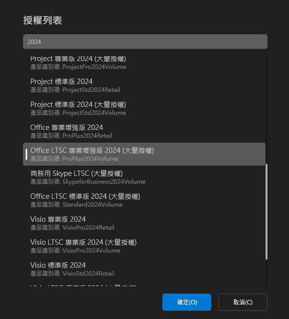

---
## KMS主機
KMS主機輸入，在按下 `設定主機`

jameshost.org


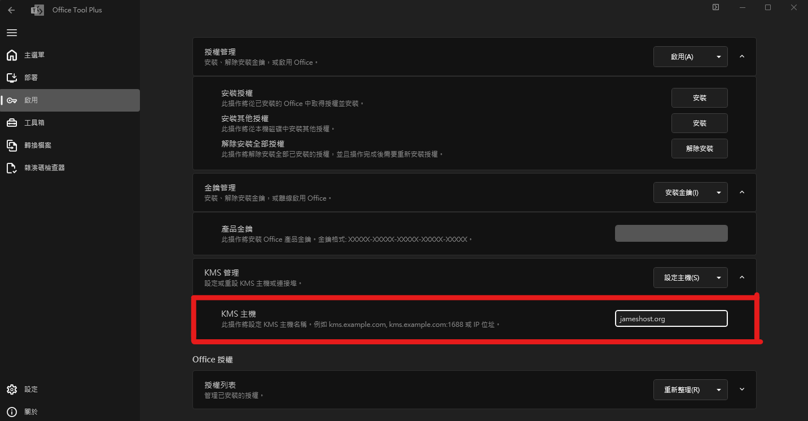

---
## 啟用
- 按下`啟用`

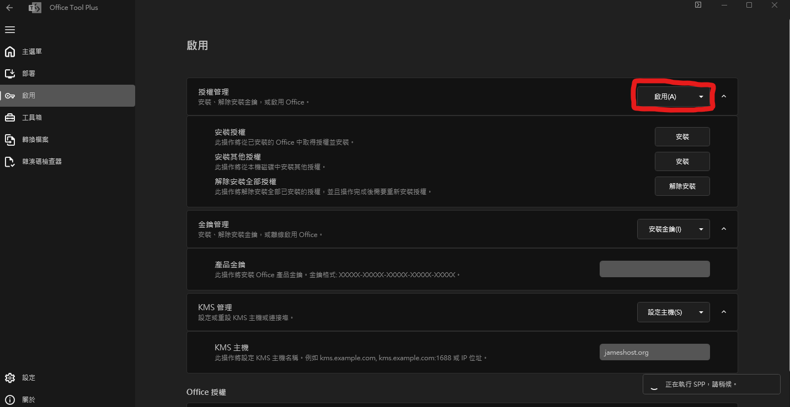

---
## 啟用成功
> 到這邊就可以關閉`Office Tool Plus`
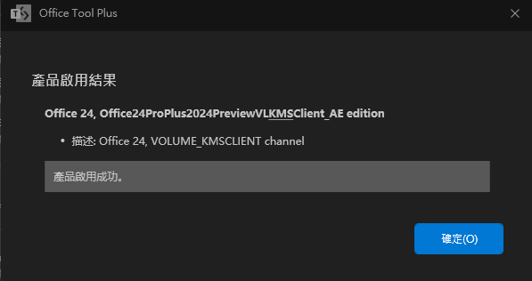

---
## 完成
> 恭喜這樣就啟用成功拉~

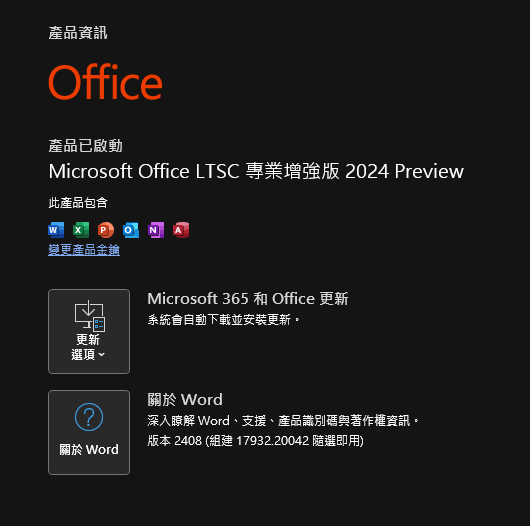
