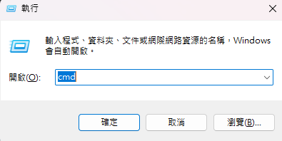
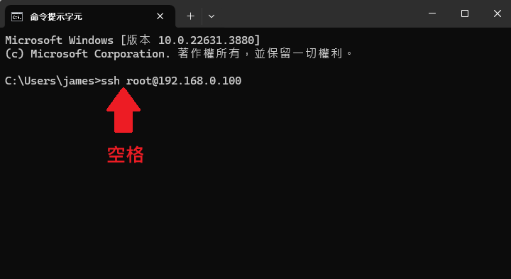
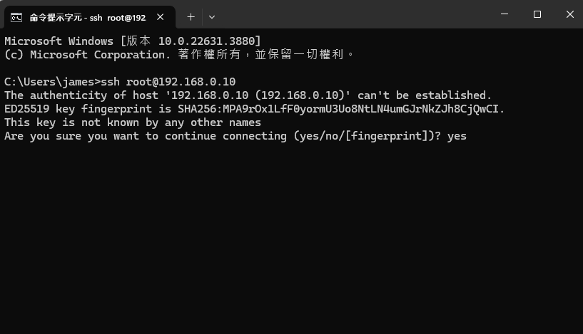
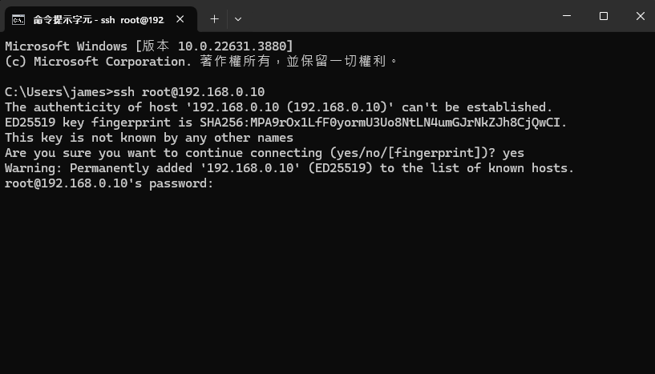
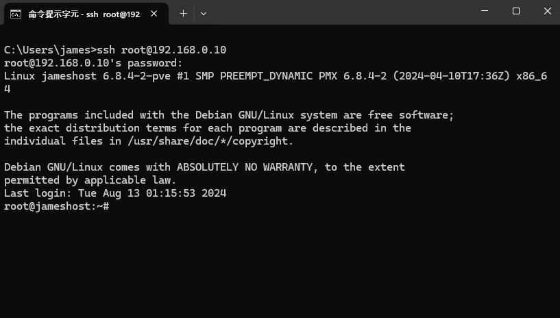

+++
title = '使用Windows命令行ssh連結Linux'
date = 2024-08-18T03:17:13+08:00
draft = false
image = 'cmd.png'
categories = [
    "linux"
]
tags = [
    "linux",
]
+++

## 前言
SSH 簡單來說它就是一個遠端連線的工具，安全是 SSH 的賣點。SSH 它讓我們在與遠端電腦（遠端伺服器）連線時，能夠先將訊息加密過後再傳送，並且確保只有「被認可的人」才能夠解密訊息。

參考:[傳送門](https://medium.com/starbugs/security-%E4%BD%A0%E8%A9%B2%E7%9F%A5%E9%81%93%E6%89%80%E6%9C%89%E9%97%9C%E6%96%BC-ssh-%E7%9A%84%E9%82%A3%E4%BA%9B%E4%BA%8B-76b3518cb747)
## 打開cmd
> 按下鍵盤 <kbd>Win</kbd> + <kbd>R</kbd> 並輸入`cmd`

---
## 指令
> 指令格式為 `ssh` + `空格` + `用戶名` + `@ip` 然後按 <kbd>ENTER</kbd>

---
## 輸入yes
> 輸入yes

---
# 密碼
> 輸入使用者密碼，過程中`看不到任何文字`

---
# 成功
> 如果密碼輸入正確，連結成功✅

