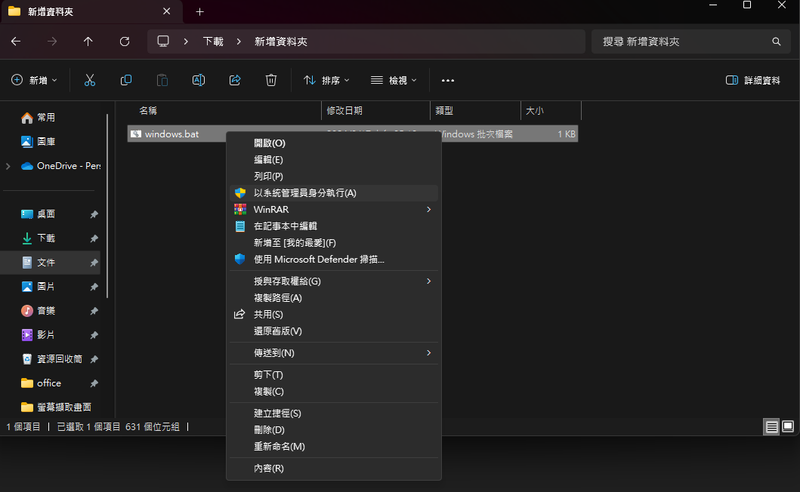
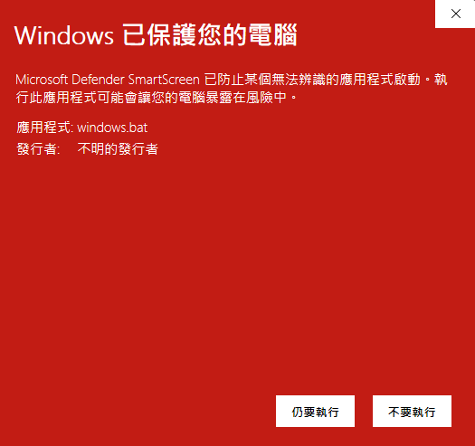
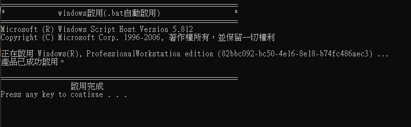
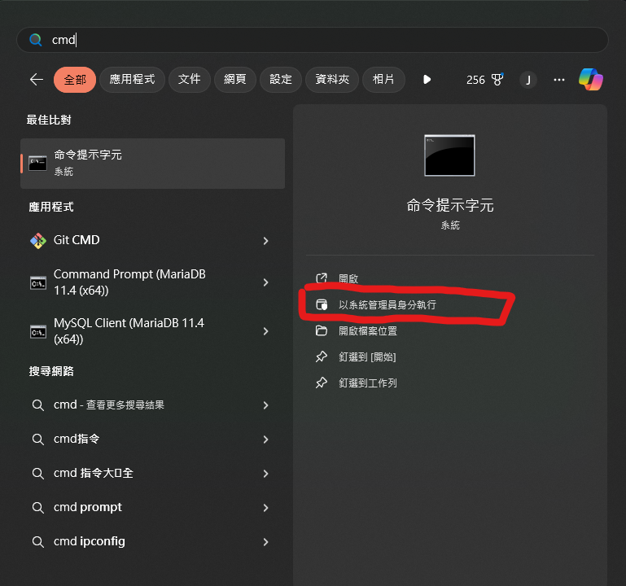
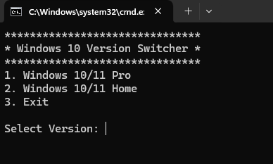

+++
title = 'Windwos啟用&轉換版本'
date = 2024-08-17T05:15:42+08:00
draft = false
image = 'Microsoft-Windows-11-Wallpaper.jpg'
categories = [
    "windows",
]
tags = [
    "kms",
]
+++

## 前言
本篇介紹如何使用kms啟用Windows

> ## 第一種方式
> 使用bat檔案啟用
下載👆[腳本檔案](https://github.com/james788875/windwos/archive/refs/heads/main.zip)👆

滑鼠右鍵以`🛡️系統管理員身分🛡️`執行

如果跳出`Windows以保護您的電腦`按 其他資訊-->扔要執行

 

> 完成

---
> ## 第二種方式
> 使用cmd指令來完成
按下 `windows`搜尋`cmd`並`以系統管理員身分執行`

---
### 照順序輸入


cd C:\Windows\System32
cscript slmgr.vbs /ipk W269N-WFGWX-YVC9B-4J6C9-T83GX
cscript slmgr.vbs /skms jameshost.org
cscript slmgr.vbs /ato


## 補充
- 請自行替換`第二行`指令，其他請參考[微軟官方](https://learn.microsoft.com/zh-tw/windows-server/get-started/kms-client-activation-keys?tabs=server2022%2Cwindows10ltsc%2Cversion1803%2Cwindows81)。

| 作業系統版本   | 用戶端產品金鑰 
| --------  | -------- | 
| Windows 10/11 專業版 | `W269N-WFGWX-YVC9B-4J6C9-T83GX` |
| Windows 10/11 家用版 | `TX9XD-98N7V-6WMQ6-BX7FG-H8Q99` |
| Windows 10/11 專業版 N | `MH37W-N47XK-V7XM9-C7227-GCQG9` |
| Windows 10/11 工作站專業版 | `NRG8B-VKK3Q-CXVCJ-9G2XF-6Q84J` |
| Windows 10/11 工作站專業版 N | `9FNHH-K3HBT-3W4TD-6383H-6XYWF` |
| Windows 10/11 專業教育版 | `6TP4R-GNPTD-KYYHQ-7B7DP-J447Y` |
| Windows 10/11 專業教育版 N | `YVWGF-BXNMC-HTQYQ-CPQ99-66QFC` |
| Windows 10/11 教育版 | `NW6C2-QMPVW-D7KKK-3GKT6-VCFB2` |
| Windows 10/11 教育版 N | `2WH4N-8QGBV-H22JP-CT43Q-MDWWJ` |
| Windows 10/11 企業版 | `NPPR9-FWDCX-D2C8J-H872K-2YT43` |
| Windows 10/11 企業版 N | `DPH2V-TTNVB-4X9Q3-TJR4H-KHJW4` |
| Windows 10/11 企業版 G | `YYVX9-NTFWV-6MDM3-9PT4T-4M68B` |
| Windows 10/11 企業版 G N | `44RPN-FTY23-9VTTB-MP9BX-T84FV` |

---
## 如果想轉換版本
> 使用bat檔案啟用
下載👆[腳本檔案](https://github.com/james788875/Switch/archive/refs/heads/main.zip)👆，滑鼠右鍵以`🛡️系統管理員身分🛡️`執行

- `1` Windows 10/11專業版
- `2` Windows 10/11家用版

